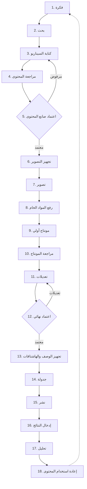

# دليل دورة إنتاج المحتوى (Production Workflow Playbook)
### منتج «صانع المحتوى» (Content Maker) من نوفاميتريكس (NovaMetrics)

> **النطاق:** يصف هذا الدليل دورة العمل الافتراضية المكوّنة من **18 مرحلة** لكل مقطع، من الفكرة حتى إعادة الاستخدام، على منصة TikTok أولاً. لكل مرحلة: المسؤول الافتراضي، المخرجات، Checklist، معايير الانتقال، SLA مقترح، أسباب التأخير الشائعة، والتنبيهات.
>
> **تنويه:** بنود الامتثال المشار إليها تشغيلية و**تتطلب تحققًا نظاميًا محدثًا**. **المراجعة القانونية النهائية يجب أن ينفذها مختص قانوني مرخّص.**

**مفتاح الأدوار:** CM = مدير المحتوى | Writer = الكاتب | Ops = منسّق الإنتاج | Analyst = المحلل | Client = صانع المحتوى | AM = مدير الحساب

---

## 1. مخطط دورة العمل (Mermaid Flowchart)

---

## 2. تفصيل المراحل الثماني عشرة

### المرحلة 1 — فكرة
- **المسؤول:** CM
- **المخرجات:** فكرة محددة مربوطة بمحور الشهر والهدف.
- **Checklist:** مطابقة للاستراتيجية · تناسب TikTok · غير مكرّرة · تحترم القيم.
- **معيار الانتقال:** الفكرة موثّقة ومصنّفة.
- **SLA مقترح:** ضمن جلسة التخطيط الشهرية.
- **أسباب التأخير:** غياب محور واضح، تكدّس أفكار غير مرتّبة.
- **التنبيهات:** تنبيه عند نقص أفكار مقابل الخطة الشهرية.

### المرحلة 2 — بحث
- **المسؤول:** Writer
- **المخرجات:** مادة بحثية (مصادر، ترندات، زوايا، مراجع).
- **Checklist:** مصادر موثوقة · فحص الترند على TikTok · تدقيق الادعاءات · لا حقوق منتهكة.
- **معيار الانتقال:** مادة بحثية كافية لكتابة سيناريو.
- **SLA مقترح:** يوم عمل.
- **أسباب التأخير:** موضوع واسع، صعوبة إيجاد مصادر.
- **التنبيهات:** تنبيه عند تجاوز زمن البحث.

### المرحلة 3 — كتابة السيناريو
- **المسؤول:** Writer
- **المخرجات:** سيناريو كامل (خطاف، جسم، دعوة لإجراء) بنبرة الشخصية.
- **Checklist:** خطاف أول 3 ثوانٍ · مطابقة النبرة · مدة مناسبة · لا موضوعات مرفوضة.
- **معيار الانتقال:** مسودة جاهزة للمراجعة.
- **SLA مقترح:** يوم–يومَي عمل.
- **أسباب التأخير:** بحث ناقص، عدم وضوح الزاوية.
- **التنبيهات:** تنبيه اقتراب موعد المراجعة.

### المرحلة 4 — مراجعة المحتوى
- **المسؤول:** CM
- **المخرجات:** سيناريو محرّر + ملاحظات جودة وامتثال أولية.
- **Checklist:** جودة تحريرية · مطابقة استراتيجية · فحص امتثال أولي · وضوح التنفيذ.
- **معيار الانتقال:** نسخة نظيفة جاهزة لاعتماد العميل.
- **SLA مقترح:** يوم–يومَي عمل (حسب الباقة).
- **أسباب التأخير:** جولات تحرير متعددة.
- **التنبيهات:** تنبيه عند تجاوز زمن المراجعة.

### المرحلة 5 — اعتماد صانع المحتوى (بوابة قرار)
- **المسؤول:** Client (R)
- **المخرجات:** اعتماد موثّق أو ملاحظات رفض.
- **Checklist:** موافقة على الزاوية · موافقة على النبرة · لا تحفّظات.
- **معيار الانتقال:** اعتماد موثّق للانتقال للتصوير.
- **SLA مقترح:** حسب زمن رد العميل (يوقف ساعة SLA).
- **أسباب التأخير:** بطء رد العميل، طلبات تعديل جذرية.
- **التنبيهات:** تذكير تلقائي للعميل عند انتظار الاعتماد.

### المرحلة 6 — تجهيز التصوير
- **المسؤول:** Ops
- **المخرجات:** Call Sheet + قائمة معدّات ومواقع وأدوار.
- **Checklist:** موقع مؤكّد · معدّات جاهزة · جدول زمني · موافقات الأشخاص الظاهرين.
- **معيار الانتقال:** Call Sheet معمّم ومؤكّد.
- **SLA مقترح:** قبل يوم التصوير بيوم عمل على الأقل.
- **أسباب التأخير:** عدم توفر موقع/معدّات، تعارض مواعيد.
- **التنبيهات:** تنبيه نقص جاهزية قبل يوم التصوير.

### المرحلة 7 — تصوير
- **المسؤول:** Ops + Client
- **المخرجات:** لقطات خام كاملة وفق السيناريو.
- **Checklist:** تغطية كل المشاهد · جودة صوت/صورة · لقطات احتياطية (B-roll).
- **معيار الانتقال:** اكتمال المشاهد المطلوبة.
- **SLA مقترح:** يوم التصوير المجدول.
- **أسباب التأخير:** ظروف الموقع، إعادة تصوير.
- **التنبيهات:** تفعيل «وضع يوم التصوير» (انظر القسم 5).

### المرحلة 8 — رفع المواد الخام
- **المسؤول:** Ops
- **المخرجات:** مواد خام مرفوعة ومنظّمة ومسمّاة.
- **Checklist:** رفع كامل · تسمية منظّمة · نسخة احتياطية · ربط بالمشروع.
- **معيار الانتقال:** المواد متاحة للمونتير.
- **SLA مقترح:** خلال يوم عمل من التصوير.
- **أسباب التأخير:** حجم ملفات، ضعف الاتصال.
- **التنبيهات:** تنبيه اكتمال الرفع.

### المرحلة 9 — مونتاج أولي
- **المسؤول:** CM (فريق المونتاج)
- **المخرجات:** نسخة أولية (Rough Cut).
- **Checklist:** بنية السيناريو · خطاف قوي · إيقاع · موسيقى/عناصر مرخّصة.
- **معيار الانتقال:** نسخة أولية جاهزة للمراجعة.
- **SLA مقترح:** حسب الباقة والأولوية.
- **أسباب التأخير:** مواد ناقصة، تعقيد المونتاج.
- **التنبيهات:** تنبيه اقتراب موعد المراجعة.

### المرحلة 10 — مراجعة المونتاج
- **المسؤول:** CM
- **المخرجات:** ملاحظات مراجعة مرتّبة.
- **Checklist:** جودة تقنية · مطابقة السيناريو · فحص امتثال (موسيقى/حقوق) · نسبة 9:16.
- **معيار الانتقال:** ملاحظات محدّدة قابلة للتنفيذ.
- **SLA مقترح:** يوم–يومَي عمل.
- **أسباب التأخير:** تعدّد المراجعين.
- **التنبيهات:** تنبيه تجاوز زمن المراجعة.

### المرحلة 11 — تعديلات
- **المسؤول:** CM (فريق المونتاج)
- **المخرجات:** نسخة مُعدّلة وفق الملاحظات.
- **Checklist:** تنفيذ كل الملاحظات · لا أخطاء جديدة · جاهزية للاعتماد.
- **معيار الانتقال:** نسخة شبه نهائية.
- **SLA مقترح:** يوم–يومَي عمل.
- **أسباب التأخير:** جولات تعديل متكررة.
- **التنبيهات:** تنبيه عند تجاوز عدد جولات التعديل المعتاد.

### المرحلة 12 — اعتماد نهائي (بوابة قرار)
- **المسؤول:** Client (R)
- **المخرجات:** اعتماد نهائي موثّق أو طلب تعديل.
- **Checklist:** رضا كامل · اجتياز الجودة · اجتياز الامتثال · لا تحفّظات.
- **معيار الانتقال:** اعتماد نهائي موثّق للنشر.
- **SLA مقترح:** حسب زمن رد العميل (يوقف ساعة SLA).
- **أسباب التأخير:** بطء العميل، ملاحظات متأخرة.
- **التنبيهات:** تذكير العميل + حظر النشر دون اعتماد.

### المرحلة 13 — تجهيز الوصف والهاشتاقات
- **المسؤول:** Writer
- **المخرجات:** وصف + هاشتاقات + إفصاح إعلاني عند الحاجة.
- **Checklist:** دقة لغوية · هاشتاقات ملائمة · **إفصاح إعلاني إن كان المحتوى تجارياً** · لا ادعاءات غير مثبتة.
- **معيار الانتقال:** نص نشر جاهز ومعتمد.
- **SLA مقترح:** يوم عمل.
- **أسباب التأخير:** غياب معلومات الحملة.
- **التنبيهات:** تنبيه امتثال إن كان المحتوى إعلانياً — **يتطلب تحققًا نظاميًا محدثًا**.

### المرحلة 14 — جدولة
- **المسؤول:** CM
- **المخرجات:** موعد نشر مثبّت في التقويم.
- **Checklist:** توقيت مثالي للجمهور · لا تعارض مع مقاطع أخرى · مطابقة أيام النشر.
- **معيار الانتقال:** المقطع مجدول.
- **SLA مقترح:** فور الاعتماد النهائي.
- **أسباب التأخير:** ازدحام التقويم.
- **التنبيهات:** تأكيد الجدولة.

### المرحلة 15 — نشر
- **المسؤول:** CM
- **المخرجات:** مقطع منشور على TikTok + حفظ النسخة النهائية المنشورة.
- **Checklist:** النشر تم بنجاح · الوصف/الهاشتاقات صحيحة · **حفظ النسخة النهائية للأرشيف**.
- **معيار الانتقال:** رابط النشر موثّق.
- **SLA مقترح:** الموعد المجدول.
- **أسباب التأخير:** أعطال تقنية بالمنصة.
- **التنبيهات:** تأكيد النشر أو تنبيه فشله.

### المرحلة 16 — إدخال النتائج
- **المسؤول:** Analyst
- **المخرجات:** بيانات الأداء (مشاهدات، تفاعل، حفظ، مشاركة).
- **Checklist:** بيانات كاملة · فترة قياس مناسبة · دقة الإدخال.
- **معيار الانتقال:** بيانات جاهزة للتحليل.
- **SLA مقترح:** بعد فترة قياس محددة من النشر.
- **أسباب التأخير:** تأخر توفر بيانات المنصة.
- **التنبيهات:** تذكير إدخال النتائج.

### المرحلة 17 — تحليل
- **المسؤول:** Analyst
- **المخرجات:** قراءة أداء + دروس مستفادة.
- **Checklist:** مقارنة بالأهداف · تحديد ما نجح/فشل · توصيات.
- **معيار الانتقال:** رؤى موثّقة تدخل التقرير الشهري.
- **SLA مقترح:** ضمن دورة التقرير الشهري.
- **أسباب التأخير:** بيانات ناقصة.
- **التنبيهات:** تنبيه مقاطع الأداء المتدني/العالي.

### المرحلة 18 — إعادة استخدام المحتوى
- **المسؤول:** CM + Analyst
- **المخرجات:** خطة إعادة استخدام (Repurpose) للمحتوى الناجح.
- **Checklist:** تحديد المقاطع القابلة لإعادة الاستخدام · منصات إضافية · صيغ مشتقّة.
- **معيار الانتقال:** أفكار جديدة تُغذّي المرحلة 1.
- **SLA مقترح:** ضمن التخطيط الشهري التالي.
- **أسباب التأخير:** غياب توثيق الأداء.
- **التنبيهات:** اقتراح تلقائي لإعادة استخدام المقاطع عالية الأداء.

---

## 3. تخصيص دورة العمل لكل عميل

- **تفعيل/تعطيل مراحل:** يمكن دمج مراحل في باقة النجم (مثل دمج المراجعة والتعديلات) أو تفصيلها في الإدارة المتكاملة.
- **بوابات الاعتماد إلزامية:** المرحلتان 5 و12 (اعتماد صانع المحتوى والاعتماد النهائي) **لا تُلغى أبداً**.
- **تعديل الـ SLA:** تُضبط الأزمنة حسب حجم الإنتاج والباقة وتُثبَّت في العقد.
- **قوالب حسب نوع المحتوى:** إنشاء مسارات فرعية (مثل: محتوى تفاعلي سريع مقابل محتوى إنتاجي مكثّف).
- **حقول امتثال إضافية:** تُضاف حسب مجال العميل — **يتطلب تحققًا نظاميًا محدثًا**.

---

## 4. نقاط تماس الأدوار والصلاحيات (Roles/Permissions Touchpoints)

| المرحلة | من يملك التنفيذ | من يعتمد | صلاحية حسّاسة |
|---|---|---|---|
| 3–4 كتابة/مراجعة | Writer/CM | CM | تحرير المحتوى |
| 5 اعتماد صانع المحتوى | — | **Client** | صلاحية اعتماد حصرية |
| 7 تصوير | Ops | — | إدارة المواد الخام |
| 9–11 مونتاج/تعديل | فريق المونتاج | CM | الوصول للمواد الخام |
| 12 اعتماد نهائي | — | **Client** | صلاحية اعتماد حصرية |
| 14–15 جدولة/نشر | CM | CM | **صلاحية النشر** (مقيّدة) |
| 16–17 نتائج/تحليل | Analyst | CM | الوصول للتحليلات |

> **مبدأ:** صلاحية **النشر** وصلاحية **الاعتماد** منفصلتان، ولا تُمنح صلاحية النشر إلا بعد اعتماد نهائي موثّق.

---

## 5. وضع يوم التصوير (Shoot-Day Mode) ومحتوى الـ Call Sheet

### وضع يوم التصوير
واجهة/حالة تشغيلية تُفعَّل في المرحلة 7 لتجميع كل ما يحتاجه الفريق في مكان واحد أثناء التصوير: السيناريو، قائمة اللقطات، الجدول الزمني، وتسجيل حالة كل مشهد (تم/يحتاج إعادة)، مع رفع سريع للمواد الخام في نهاية اليوم.

### محتوى الـ Call Sheet
- **التاريخ والوقت** (وقت البدء/الانتهاء المتوقع).
- **الموقع** (العنوان، نقطة التجمّع، مواقف/تصاريح إن لزم).
- **جهات الاتصال** (منسّق الإنتاج، صانع المحتوى، أرقام الطوارئ).
- **قائمة اللقطات (Shot List)** حسب السيناريو + لقطات B-roll.
- **الأدوار والحضور** (من المسؤول عن ماذا).
- **المعدّات المطلوبة** (كاميرا، صوت، إضاءة، إكسسوارات).
- **الجدول الزمني للمشاهد** (تسلسل التصوير).
- **الملابس/الماكياج/الديكور** عند الحاجة.
- **موافقات الأشخاص الظاهرين** — **يتطلب تحققًا نظاميًا محدثًا**.
- **ملاحظات الامتثال والسلامة**.
- **خطة بديلة** (طقس/موقع بديل).

---

## 6. الروابط

- تقديم الخدمة: `service-delivery-playbook-ar.md`
- تهيئة العميل: `client-onboarding-checklist-ar.md`
- الامتثال: `compliance-checklist-ar.md`

---

> **تنويه ختامي:** بنود الامتثال والحقوق والموافقات **تتطلب تحققًا نظاميًا محدثًا**، و**المراجعة القانونية النهائية يجب أن ينفذها مختص قانوني مرخّص.**

