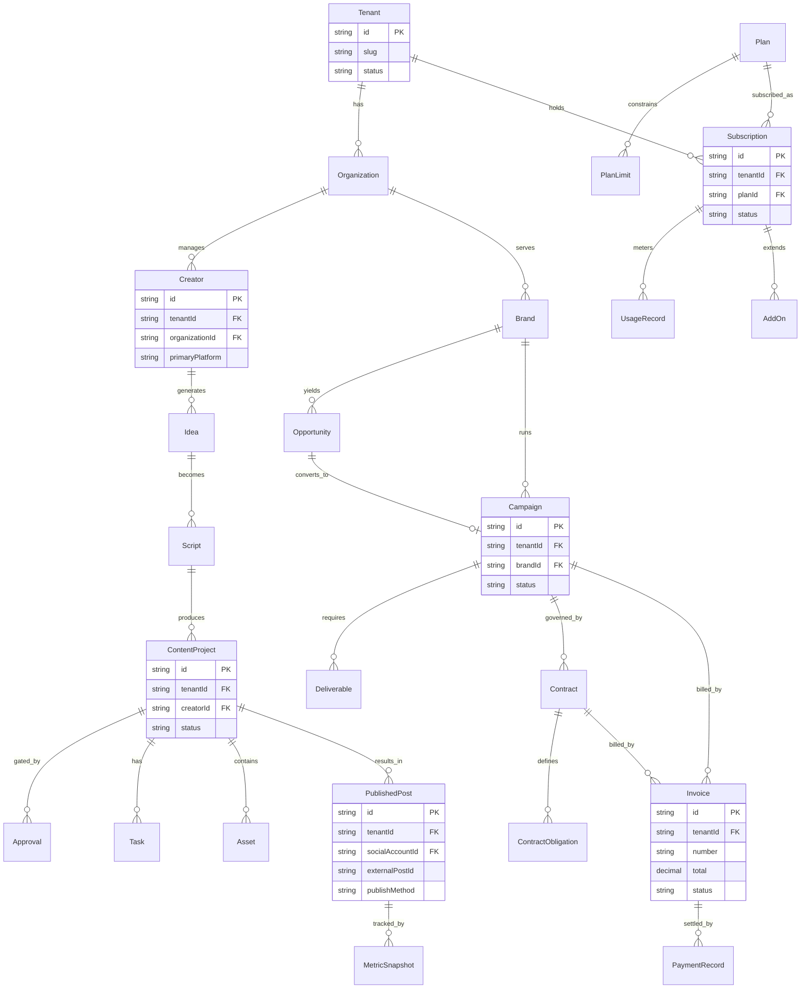

# تصميم قاعدة البيانات — «صانع المحتوى» / Content Maker

**المنتج:** «صانع المحتوى» / *Content Maker*
**الجهة:** نوفاميتريكس | NovaMetrics
**المنصة:** موجّهة أولًا إلى TikTok، وجاهزة لتعدد المنصات عبر نمط المُحوِّل (Adapter Pattern).
**قاعدة البيانات:** PostgreSQL عبر Prisma ORM.

> ملاحظة عن الاصطلاح: النصوص والشرح باللغة العربية، بينما تبقى **أسماء الكيانات والأعمدة وأنواع البيانات وجمل SQL** بالإنجليزية حسب معيار «واجهة عربية، شيفرة إنجليزية».

---

## 1. المبادئ العامة للتصميم

يعتمد التصميم على مجموعة قواعد ثابتة تُطبَّق على **جميع** الجداول التشغيلية ما لم يُذكر خلاف ذلك:

1. **تعدد المستأجرين من اليوم الأول (Multi-Tenant):** كل صف قابل للعزل يحمل عمود `tenantId` لضمان العزل الصارم بين المستأجرين.
2. **المفاتيح الأساسية:** نستخدم معرّفات من نوع `String` بصيغة `cuid()`/`uuid` (يُشار إليها بـ `id`) لتجنّب تسريب أحجام البيانات وتسهيل التوزيع.
3. **الحذف الناعم (Soft Delete):** عمود `deletedAt: timestamptz NULL`. الصف يُعدّ محذوفًا منطقيًا عندما لا تكون القيمة `NULL`. لا نحذف فيزيائيًا إلا عبر مهام أرشفة/تطهير مُدارة.
4. **التدقيق الزمني والمُسنِد:** كل جدول يحوي `createdAt`, `updatedAt`, `createdBy`, `updatedBy` (المُسنِدان يشيران إلى `User.id`).
5. **الفهرسة المُركّبة على المستأجر:** الفهارس التشغيلية تبدأ بـ `tenantId` (مثال: `@@index([tenantId, status])`) لأن كل الاستعلامات مُقيّدة بالمستأجر.
6. **القيود المرجعية والسلاسل (Cascade):** تُدار بعناية؛ العلاقات «المِلكية» تستخدم `onDelete: Cascade` عند الحذف الفيزيائي النادر، بينما العلاقات المرجعية الحسّاسة تستخدم `Restrict`/`SetNull` (تفاصيل في القسم 7).
7. **لا أسرار في قاعدة البيانات بصيغة واضحة:** رموز الوصول (OAuth tokens) والأسرار تُخزَّن **مُشفّرة عند الراحة** (application-level encryption) وليست نصًا صريحًا.
8. **التعدادات (Enums):** الحالات المحدودة تُمثَّل كـ `enum` في Prisma/PostgreSQL لضمان سلامة البيانات.

### اصطلاح أنواع البيانات المستخدمة

| النوع في الوثيقة | المقابل في PostgreSQL | الاستخدام |
|---|---|---|
| `String` | `text` / `varchar` | معرّفات ونصوص |
| `Int` | `integer` | أعداد صحيحة |
| `BigInt` | `bigint` | عدّادات كبيرة (مشاهدات، بايتات) |
| `Decimal` | `numeric(18,4)` | مبالغ مالية ونِسَب |
| `Boolean` | `boolean` | أعلام منطقية |
| `DateTime` | `timestamptz` | أوقات بالمنطقة الزمنية |
| `Json` | `jsonb` | حقول مرنة/بيانات وصفية |
| `Enum` | `enum` | حالات محدودة |

---

## 2. استراتيجية تعدد المستأجرين والعزل

نتبنّى نموذج **قاعدة بيانات مشتركة / مخطط مشترك (Shared Database, Shared Schema)** مع عزل على مستوى الصف (Row-Level Scoping):

- **عمود `tenantId` إلزامي** في كل جدول قابل للعزل، ويشير إلى `Tenant.id`.
- **طبقة الوصول (Data Access Layer):** كل استعلام يمرّ عبر Prisma middleware/extension يحقن شرط `where: { tenantId }` تلقائيًا من سياق الجلسة، فلا يمكن لكود التطبيق نسيان التقييد.
- **Row-Level Security (RLS) في PostgreSQL:** كطبقة دفاع ثانية، تُفعَّل سياسات RLS تربط `tenantId` بمتغيّر جلسة (`current_setting('app.tenant_id')`) بحيث يفشل أي استعلام لا يحمل السياق الصحيح — دفاع في العمق حتى لو أخطأ التطبيق.
- **المفاتيح الفريدة على نطاق المستأجر:** القيود الفريدة تُركَّب مع `tenantId` (مثال: بريد المستخدم فريد داخل المستأجر: `@@unique([tenantId, email])`).
- **الحذف الناعم على مستوى المستأجر:** استعلامات القراءة تستثني `deletedAt IS NOT NULL` افتراضيًا عبر نفس الطبقة الوسيطة.
- **التدقيق:** كل عملية كتابة حسّاسة تُسجَّل في `AuditLog` مع `tenantId` و`actorUserId` وبيانات التغيير.

**كيان `Tenant`** هو الجذر الأعلى؛ **`Organization`** يمثّل وحدة عمل داخل المستأجر (قد يحوي المستأجر أكثر من مؤسسة/فريق). العزل الأمني يقع على مستوى `Tenant`، بينما `Organization` أداة تنظيمية داخلية.

---

## 3. الكيانات التفصيلية

> جميع الكيانات ترث الأعمدة المشتركة: `id (String, PK)`, `tenantId (String, FK→Tenant, NOT NULL)*`, `createdAt (DateTime)`, `updatedAt (DateTime)`, `createdBy (String, FK→User NULL)`, `updatedBy (String, FK→User NULL)`, `deletedAt (DateTime NULL)`.
> (*) الاستثناء: `Tenant` نفسه لا يحمل `tenantId`، وبعض جداول الأنظمة العامة كـ `Plan` قد تكون عالمية (global) كما هو موضّح.

### 3.1 نطاق الهوية والصلاحيات (Identity & RBAC)

#### Tenant
- **الغرض:** الجذر الأعلى لعزل البيانات؛ يمثّل عميلًا/حسابًا مشتركًا كاملًا.
- **الأعمدة المهمة:**
  - `id: String` — PK.
  - `name: String` — الاسم التجاري للمستأجر.
  - `slug: String` — معرّف نصّي فريد عالميًا للربط بالنطاق الفرعي/المسار.
  - `status: Enum(ACTIVE, SUSPENDED, TRIAL, CLOSED)`.
  - `region: String` — منطقة استضافة/امتثال البيانات (مثال `KSA`).
  - `settings: Json` — إعدادات عامة (اللغة الافتراضية، المنطقة الزمنية).
- **العلاقات:** 1—N مع `Organization`, `User`, `Subscription`, وجميع الكيانات التشغيلية.
- **الفهارس:** `@@unique([slug])`, `@@index([status])`.
- **القيود:** `slug` فريد عالميًا؛ لا يُحذف `Tenant` نعومةً إلا بعد إغلاق الاشتراكات.

#### Organization
- **الغرض:** وحدة تنظيمية/فريق داخل المستأجر (وكالة قد تدير عدّة فرق).
- **الأعمدة المهمة:** `name: String`, `type: Enum(AGENCY, IN_HOUSE, TEAM)`, `parentOrgId: String NULL` (تسلسل هرمي اختياري), `settings: Json`.
- **العلاقات:** N—1 مع `Tenant`; 1—N مع `Membership`, `Creator`, `Brand`, `Campaign`.
- **الفهارس:** `@@index([tenantId])`, `@@index([tenantId, parentOrgId])`.
- **القيود:** `@@unique([tenantId, name])`.

#### User
- **الغرض:** حساب بشري يسجّل الدخول للنظام (مدير، محرّر، منشئ، مراجع).
- **الأعمدة المهمة:**
  - `email: String` — البريد.
  - `passwordHash: String NULL` — تجزئة كلمة المرور (argon2id) — لا تُخزَّن كلمة المرور أبدًا.
  - `displayName: String`, `locale: String (default 'ar')`, `avatarAssetId: String NULL`.
  - `status: Enum(ACTIVE, INVITED, DISABLED)`.
  - `mfaEnabled: Boolean (default false)`, `mfaSecretEnc: String NULL` (مُشفّر).
  - `lastLoginAt: DateTime NULL`.
- **العلاقات:** N—1 مع `Tenant`; 1—N مع `Membership`, `Notification`, `AuditLog(actor)`.
- **الفهارس:** `@@unique([tenantId, email])`, `@@index([tenantId, status])`.
- **القيود:** البريد فريد داخل المستأجر؛ لا نص صريح للأسرار.

#### Role
- **الغرض:** دور RBAC داخلي يجمع مجموعة صلاحيات.
- **الأعمدة المهمة:** `key: String` (مثل `admin`, `editor`, `creator`, `reviewer`), `name: String`, `isSystem: Boolean` (أدوار مدمجة غير قابلة للحذف), `description: String NULL`.
- **العلاقات:** M—N مع `Permission` عبر جدول ربط `RolePermission`; 1—N مع `Membership`.
- **الفهارس:** `@@unique([tenantId, key])`.
- **القيود:** الأدوار النظامية `isSystem = true` محميّة من التعديل/الحذف.

#### Permission
- **الغرض:** صلاحية ذرّية (وحدة تحكّم دقيقة) على مورد وإجراء.
- **الأعمدة المهمة:** `key: String` (نمط `resource:action`، مثل `script:approve`, `publishedpost:create`), `resource: String`, `action: String`, `description: String NULL`.
- **العلاقات:** M—N مع `Role`.
- **الفهارس:** `@@unique([key])` (كتالوج صلاحيات قد يكون عالميًا مع تخصيص لكل مستأجر عند الحاجة).
- **القيود:** صيغة `key` موحّدة `resource:action`.

#### Membership
- **الغرض:** يربط `User` بـ `Organization`/`Tenant` عبر `Role` معيّن (عضوية).
- **الأعمدة المهمة:** `userId: String (FK)`, `organizationId: String (FK)`, `roleId: String (FK)`, `status: Enum(ACTIVE, PENDING, REVOKED)`, `invitedBy: String NULL`.
- **العلاقات:** N—1 مع `User`, `Organization`, `Role`.
- **الفهارس:** `@@unique([tenantId, userId, organizationId])`, `@@index([tenantId, roleId])`.
- **القيود:** لا يُكرَّر عضو نفسه في نفس المؤسسة.

### 3.2 نطاق المنشئ والاستراتيجية (Creator & Strategy)

#### Creator
- **الغرض:** يمثّل صانع محتوى (شخصية/علامة شخصية) تُدار له الاستراتيجية والمحتوى.
- **الأعمدة المهمة:** `handle: String`, `displayName: String`, `niche: String NULL` (المجال), `bio: String NULL`, `primaryPlatform: Enum(TIKTOK, INSTAGRAM, YOUTUBE, ...)` (افتراضي `TIKTOK`), `status: Enum(ACTIVE, PAUSED, ARCHIVED)`, `organizationId: String (FK)`.
- **العلاقات:** N—1 مع `Organization`; 1—N مع `SocialAccount`, `CreatorStrategy`, `Idea`, `ContentProject`, `EditorialCalendarItem`.
- **الفهارس:** `@@index([tenantId, organizationId])`, `@@unique([tenantId, handle])`.
- **القيود:** `handle` فريد داخل المستأجر.

#### SocialAccount
- **الغرض:** حساب على منصة اجتماعية مرتبط بمنشئ (بيانات وصفية للحساب لا كلمات مرور).
- **الأعمدة المهمة:** `creatorId: String (FK)`, `platform: Enum(...)`, `externalAccountId: String NULL` (المعرّف من المنصة), `username: String`, `oauthConnectionId: String NULL (FK→OAuthConnection)`, `status: Enum(CONNECTED, DISCONNECTED, NEEDS_REAUTH, EXPIRED, ERROR, PAUSED)`, `followersCount: BigInt NULL`.
- **العلاقات:** N—1 مع `Creator`; N—1 مع `OAuthConnection`; 1—N مع `PublishedPost`.
- **الفهارس:** `@@unique([tenantId, platform, externalAccountId])`, `@@index([tenantId, creatorId])`.
- **القيود:** **لا تُخزَّن كلمات مرور المنصات إطلاقًا**؛ الوصول عبر OAuth الرسمي فقط.

#### CreatorStrategy
- **الغرض:** المستند الاستراتيجي الحيّ لمنشئ (الأهداف، الجمهور، الركائز).
- **الأعمدة المهمة:** `creatorId: String (FK)`, `title: String`, `objective: String NULL`, `currentVersionId: String NULL (FK→StrategyVersion)`, `status: Enum(DRAFT, ACTIVE, ARCHIVED)`.
- **العلاقات:** N—1 مع `Creator`; 1—N مع `StrategyVersion`, `AudiencePersona`, `ContentPillar`.
- **الفهارس:** `@@index([tenantId, creatorId, status])`.
- **القيود:** `currentVersionId` يشير إلى نسخة تابعة لنفس الاستراتيجية.

#### StrategyVersion
- **الغرض:** لقطة/نسخة مُؤرَّخة من الاستراتيجية (تتبّع التطوّر).
- **الأعمدة المهمة:** `strategyId: String (FK)`, `versionNumber: Int`, `content: Json` (بنية الاستراتيجية), `notes: String NULL`, `authoredBy: String (FK→User)`.
- **العلاقات:** N—1 مع `CreatorStrategy`.
- **الفهارس:** `@@unique([tenantId, strategyId, versionNumber])`.
- **القيود:** `versionNumber` تصاعدي فريد داخل الاستراتيجية.

#### AudiencePersona
- **الغرض:** شخصية جمهور مستهدَفة (Persona) ضمن الاستراتيجية.
- **الأعمدة المهمة:** `strategyId: String (FK)`, `name: String`, `demographics: Json`, `painPoints: Json`, `goals: Json`, `preferredFormats: Json`.
- **العلاقات:** N—1 مع `CreatorStrategy`.
- **الفهارس:** `@@index([tenantId, strategyId])`.

#### ContentPillar
- **الغرض:** ركيزة محتوى (محور موضوعي متكرّر) تُصنَّف تحته الأفكار.
- **الأعمدة المهمة:** `strategyId: String (FK)`, `name: String`, `description: String NULL`, `targetRatio: Decimal NULL` (نسبة مستهدفة من الخطة), `color: String NULL`.
- **العلاقات:** N—1 مع `CreatorStrategy`; 1—N مع `Idea`.
- **الفهارس:** `@@unique([tenantId, strategyId, name])`.

### 3.3 نطاق الأفكار والنصوص (Ideation & Scripting)

#### Idea
- **الغرض:** فكرة محتوى خام قبل تحويلها إلى نص/مشروع.
- **الأعمدة المهمة:** `creatorId: String (FK)`, `pillarId: String NULL (FK→ContentPillar)`, `trendId: String NULL (FK→Trend)`, `title: String`, `summary: String NULL`, `source: Enum(MANUAL, TREND, AI_ASSIST, AUDIENCE_QUESTION)`, `status: Enum(NEW, EVALUATING, APPROVED, REJECTED, CONVERTED)`, `score: Decimal NULL` (تقييم أولوية).
- **العلاقات:** N—1 مع `Creator`, `ContentPillar`, `Trend`; 1—1/1—N مع `Script`; قد تنشأ من `AudienceQuestion`.
- **الفهارس:** `@@index([tenantId, creatorId, status])`, `@@index([tenantId, pillarId])`.

#### Trend
- **الغرض:** اتجاه/موضوع رائج (صوت، هاشتاق، تنسيق) يُرصد كمصدر للأفكار.
- **الأعمدة المهمة:** `platform: Enum(...)`, `type: Enum(SOUND, HASHTAG, FORMAT, TOPIC, CHALLENGE)`, `title: String`, `externalRef: String NULL`, `metrics: Json NULL` (مؤشرات الانتشار), `observedAt: DateTime`, `expiresAt: DateTime NULL`, `status: Enum(RISING, PEAKING, DECLINING, EXPIRED)`.
- **العلاقات:** 1—N مع `Idea`.
- **الفهارس:** `@@index([tenantId, platform, status])`, `@@index([tenantId, observedAt])`.
- **القيود:** بيانات الاتجاهات وصفية؛ **لا استخلاص غير رسمي (scraping)** من المنصات.

#### Script
- **الغرض:** النص/السيناريو الخاص بقطعة محتوى.
- **الأعمدة المهمة:** `ideaId: String NULL (FK→Idea)`, `creatorId: String (FK)`, `title: String`, `hook: String NULL` (الافتتاحية), `currentVersionId: String NULL (FK→ScriptVersion)`, `language: String (default 'ar')`, `status: Enum(DRAFT, IN_REVIEW, APPROVED, LOCKED)`.
- **العلاقات:** N—1 مع `Idea`, `Creator`; 1—N مع `ScriptVersion`; 1—1 مع `ContentProject`.
- **الفهارس:** `@@index([tenantId, creatorId, status])`.

#### ScriptVersion
- **الغرض:** نسخة مُؤرَّخة من النص (تتبّع المراجعات).
- **الأعمدة المهمة:** `scriptId: String (FK)`, `versionNumber: Int`, `body: String` (النص الكامل), `changeLog: String NULL`, `authoredBy: String (FK→User)`.
- **العلاقات:** N—1 مع `Script`.
- **الفهارس:** `@@unique([tenantId, scriptId, versionNumber])`.

### 3.4 نطاق الإنتاج وسير العمل (Production & Workflow)

#### ContentProject
- **الغرض:** الوحدة المحورية لإنتاج قطعة محتوى من الفكرة إلى النشر.
- **الأعمدة المهمة:** `creatorId: String (FK)`, `scriptId: String NULL (FK→Script)`, `workflowId: String NULL (FK→Workflow)`, `currentStageId: String NULL (FK→WorkflowStage)`, `title: String`, `format: Enum(SHORT_VIDEO, CAROUSEL, LIVE, PHOTO)`, `status: Enum(PLANNING, IN_PRODUCTION, IN_REVIEW, READY, SCHEDULED, PUBLISHED, ARCHIVED)`, `dueAt: DateTime NULL`, `priority: Enum(LOW, MEDIUM, HIGH)`.
- **العلاقات:** N—1 مع `Creator`, `Script`, `Workflow`; 1—N مع `Task`, `Asset`, `Approval`, `ShootSession`, `Comment`; 1—1/1—N مع `PublishedPost`, `EditorialCalendarItem`.
- **الفهارس:** `@@index([tenantId, creatorId, status])`, `@@index([tenantId, currentStageId])`, `@@index([tenantId, dueAt])`.

#### Workflow
- **الغرض:** قالب سير عمل قابل لإعادة الاستخدام (سلسلة مراحل).
- **الأعمدة المهمة:** `name: String`, `isDefault: Boolean`, `appliesTo: Enum(CONTENT, CAMPAIGN, GENERIC)`, `status: Enum(ACTIVE, ARCHIVED)`.
- **العلاقات:** 1—N مع `WorkflowStage`, `ContentProject`.
- **الفهارس:** `@@unique([tenantId, name])`.

#### WorkflowStage
- **الغرض:** مرحلة ضمن سير العمل (مثل: كتابة، تصوير، مونتاج، مراجعة، جدولة).
- **الأعمدة المهمة:** `workflowId: String (FK)`, `name: String`, `order: Int`, `slaHours: Int NULL` (اتفاق مستوى الخدمة), `entryCriteria: Json NULL`, `exitCriteria: Json NULL`.
- **العلاقات:** N—1 مع `Workflow`; 1—N مع `ContentProject(currentStage)`, `Task`.
- **الفهارس:** `@@unique([tenantId, workflowId, order])`.

#### Task
- **الغرض:** مهمة تنفيذية مُسنَدة داخل مشروع/مرحلة.
- **الأعمدة المهمة:** `contentProjectId: String NULL (FK)`, `stageId: String NULL (FK→WorkflowStage)`, `title: String`, `assigneeId: String NULL (FK→User)`, `status: Enum(TODO, IN_PROGRESS, BLOCKED, DONE, CANCELLED)`, `priority: Enum(LOW, MEDIUM, HIGH)`, `dueAt: DateTime NULL`.
- **العلاقات:** N—1 مع `ContentProject`, `WorkflowStage`, `User(assignee)`; 1—N مع `Checklist`, `Comment`.
- **الفهارس:** `@@index([tenantId, assigneeId, status])`, `@@index([tenantId, contentProjectId])`, `@@index([tenantId, dueAt])`.

#### Checklist
- **الغرض:** قائمة تحقّق (بنود) مرتبطة بمهمة أو مشروع (مثل قائمة ما قبل النشر).
- **الأعمدة المهمة:** `taskId: String NULL (FK)`, `contentProjectId: String NULL (FK)`, `title: String`, `items: Json` (بنود مع حالة `done`), `completedCount: Int`, `totalCount: Int`.
- **العلاقات:** N—1 مع `Task`/`ContentProject`.
- **الفهارس:** `@@index([tenantId, taskId])`, `@@index([tenantId, contentProjectId])`.
- **القيود:** إما `taskId` أو `contentProjectId` غير فارغ (CHECK).

#### ShootSession
- **الغرض:** جلسة تصوير مجدوَلة لمشروع محتوى (أو أكثر).
- **الأعمدة المهمة:** `contentProjectId: String NULL (FK)`, `creatorId: String (FK)`, `title: String`, `location: String NULL`, `scheduledAt: DateTime`, `durationMin: Int NULL`, `status: Enum(PLANNED, IN_PROGRESS, DONE, CANCELLED)`.
- **العلاقات:** N—1 مع `ContentProject`, `Creator`; 1—N مع `Shot`.
- **الفهارس:** `@@index([tenantId, scheduledAt])`, `@@index([tenantId, creatorId])`.

#### Shot
- **الغرض:** لقطة/مشهد ضمن جلسة تصوير (Shot list).
- **الأعمدة المهمة:** `shootSessionId: String (FK)`, `order: Int`, `description: String`, `cameraNotes: String NULL`, `status: Enum(PENDING, CAPTURED, RETAKE, SKIPPED)`, `assetId: String NULL (FK→Asset)`.
- **العلاقات:** N—1 مع `ShootSession`; 1—1 مع `Asset` (اختياري).
- **الفهارس:** `@@unique([tenantId, shootSessionId, order])`.

### 3.5 نطاق الأصول والاعتماد (Assets & Approvals)

#### Asset
- **الغرض:** ملف وسائط (فيديو، صورة، صوت، مستند) مُخزَّن في تخزين متوافق مع S3.
- **الأعمدة المهمة:** `contentProjectId: String NULL (FK)`, `type: Enum(VIDEO, IMAGE, AUDIO, DOCUMENT, THUMBNAIL)`, `title: String`, `storageKey: String` (مفتاح الكائن في S3 — لا رابط عام), `mimeType: String`, `sizeBytes: BigInt`, `checksum: String NULL`, `currentVersionId: String NULL (FK→AssetVersion)`, `status: Enum(UPLOADING, READY, FAILED, QUARANTINED)`, `visibility: Enum(PRIVATE)` (الوصول عبر Signed URLs فقط).
- **العلاقات:** N—1 مع `ContentProject`; 1—N مع `AssetVersion`; 1—1 مع `Shot` (اختياري).
- **الفهارس:** `@@index([tenantId, contentProjectId])`, `@@unique([tenantId, storageKey])`.
- **القيود:** الوصول للملفات عبر **Signed URLs** مؤقتة؛ فحص النوع/الحجم عند الرفع؛ حالة `QUARANTINED` لنتائج فحص مكافحة الفيروسات.

#### AssetVersion
- **الغرض:** نسخة من الأصل (تعديل مونتاج، إعادة تصدير).
- **الأعمدة المهمة:** `assetId: String (FK)`, `versionNumber: Int`, `storageKey: String`, `sizeBytes: BigInt`, `checksum: String NULL`, `notes: String NULL`, `uploadedBy: String (FK→User)`.
- **العلاقات:** N—1 مع `Asset`.
- **الفهارس:** `@@unique([tenantId, assetId, versionNumber])`.

#### Approval
- **الغرض:** قرار اعتماد/رفض على مورد (مشروع، نص، أصل) ضمن بوابة مراجعة.
- **الأعمدة المهمة:** `subjectType: Enum(CONTENT_PROJECT, SCRIPT, ASSET, DELIVERABLE)`, `subjectId: String` (معرّف المورد), `contentProjectId: String NULL (FK)`, `reviewerId: String (FK→User)`, `decision: Enum(PENDING, APPROVED, REJECTED, CHANGES_REQUESTED)`, `comment: String NULL`, `decidedAt: DateTime NULL`, `round: Int (default 1)`.
- **العلاقات:** N—1 مع `ContentProject`, `User(reviewer)`.
- **الفهارس:** `@@index([tenantId, subjectType, subjectId])`, `@@index([tenantId, reviewerId, decision])`.
- **القيود:** رابط متعدد الأشكال (polymorphic) عبر `subjectType + subjectId` مع تحقّق في طبقة التطبيق.

#### Comment
- **الغرض:** تعليق/نقاش عام قابل للربط بأي مورد (مشروع، مهمة، أصل، نص).
- **الأعمدة المهمة:** `subjectType: Enum(...)`, `subjectId: String`, `authorId: String (FK→User)`, `body: String`, `parentCommentId: String NULL` (ردود متداخلة), `mentions: Json NULL`, `resolvedAt: DateTime NULL`.
- **العلاقات:** N—1 مع `User(author)`; self-relation للردود.
- **الفهارس:** `@@index([tenantId, subjectType, subjectId])`, `@@index([tenantId, authorId])`.

### 3.6 نطاق الجدولة والنشر والتحليلات (Calendar, Publishing & Analytics)

#### EditorialCalendarItem
- **الغرض:** عنصر في التقويم التحريري (جدولة النشر المخطَّط).
- **الأعمدة المهمة:** `contentProjectId: String NULL (FK)`, `creatorId: String (FK)`, `platform: Enum(...)`, `plannedAt: DateTime`, `status: Enum(PLANNED, READY, SCHEDULED, PUBLISHED, MISSED, CANCELLED)`, `channelNotes: String NULL`.
- **العلاقات:** N—1 مع `ContentProject`, `Creator`; قد يرتبط بـ `PublishedPost` بعد النشر.
- **الفهارس:** `@@index([tenantId, creatorId, plannedAt])`, `@@index([tenantId, status])`.

#### PublishedPost
- **الغرض:** منشور تم نشره فعليًا على المنصة (المصدر الموثوق لبيانات ما بعد النشر).
- **الأعمدة المهمة:** `contentProjectId: String NULL (FK)`, `socialAccountId: String (FK→SocialAccount)`, `calendarItemId: String NULL (FK)`, `platform: Enum(...)`, `externalPostId: String NULL` (معرّف المنشور من المنصة), `postUrl: String NULL` (يُدخَل يدويًا في المرحلة 1، وآليًا لاحقًا), `publishMethod: Enum(MANUAL, API)`, `publishedAt: DateTime NULL`, `status: Enum(DRAFT, READY_TO_PUBLISH, PUBLISHED, FAILED)`.
- **العلاقات:** N—1 مع `SocialAccount`, `ContentProject`, `EditorialCalendarItem`; 1—N مع `MetricSnapshot`.
- **الفهارس:** `@@unique([tenantId, platform, externalPostId])`, `@@index([tenantId, socialAccountId, publishedAt])`.
- **القيود:** **لا تُعلَن حالة `PUBLISHED` عبر الـ API إلا بعد تأكيد رسمي من واجهة المنصة**؛ في المرحلة 1 يُدخل `postUrl` يدويًا بعد النشر.

#### MetricSnapshot
- **الغرض:** لقطة زمنية لمقاييس أداء منشور (views, likes, ...) لبناء السلاسل الزمنية.
- **الأعمدة المهمة:** `publishedPostId: String (FK)`, `capturedAt: DateTime`, `views: BigInt`, `likes: BigInt`, `comments: BigInt`, `shares: BigInt`, `saves: BigInt NULL`, `reach: BigInt NULL`, `watchTimeSec: BigInt NULL`, `engagementRate: Decimal NULL`, `source: Enum(MANUAL, API)`.
- **العلاقات:** N—1 مع `PublishedPost`; يُغذّي `Insight`.
- **الفهارس:** `@@index([tenantId, publishedPostId, capturedAt])`.
- **القيود:** لقطات غير قابلة للتعديل (append-only) لضمان دقّة السلاسل الزمنية.

#### Insight
- **الغرض:** استنتاج تحليلي مُشتق من المقاييس (نمط أداء، أفضل وقت نشر).
- **الأعمدة المهمة:** `creatorId: String NULL (FK)`, `contentProjectId: String NULL (FK)`, `type: Enum(PERFORMANCE, TIMING, AUDIENCE, CONTENT_PATTERN)`, `title: String`, `detail: Json`, `confidence: Decimal NULL`, `periodStart: DateTime NULL`, `periodEnd: DateTime NULL`.
- **العلاقات:** N—1 مع `Creator`, `ContentProject`; 1—N مع `Recommendation`.
- **الفهارس:** `@@index([tenantId, creatorId, type])`.

#### Recommendation
- **الغرض:** توصية عملية قابلة للتنفيذ مبنية على رؤية (Insight).
- **الأعمدة المهمة:** `insightId: String NULL (FK)`, `creatorId: String NULL (FK)`, `title: String`, `action: String`, `priority: Enum(LOW, MEDIUM, HIGH)`, `status: Enum(SUGGESTED, ACCEPTED, DISMISSED, DONE)`, `expiresAt: DateTime NULL`.
- **العلاقات:** N—1 مع `Insight`, `Creator`.
- **الفهارس:** `@@index([tenantId, creatorId, status])`.

### 3.7 النطاق التجاري (Brands, Campaigns, Contracts, Billing)

#### Brand
- **الغرض:** علامة تجارية عميلة (مُعلِن) قد تتعاقب معها فرص وحملات.
- **الأعمدة المهمة:** `organizationId: String (FK)`, `name: String`, `industry: String NULL`, `website: String NULL`, `status: Enum(PROSPECT, ACTIVE, INACTIVE)`, `notes: String NULL`.
- **العلاقات:** N—1 مع `Organization`; 1—N مع `BrandContact`, `Opportunity`, `Campaign`.
- **الفهارس:** `@@index([tenantId, organizationId])`, `@@unique([tenantId, name])`.

#### BrandContact
- **الغرض:** جهة اتصال لدى العلامة التجارية.
- **الأعمدة المهمة:** `brandId: String (FK)`, `name: String`, `email: String NULL`, `phone: String NULL`, `role: String NULL`, `isPrimary: Boolean`.
- **العلاقات:** N—1 مع `Brand`.
- **الفهارس:** `@@index([tenantId, brandId])`.

#### Opportunity
- **الغرض:** فرصة تجارية (Lead/Deal) في مسار التفاوض قبل تحوّلها لحملة.
- **الأعمدة المهمة:** `brandId: String (FK)`, `creatorId: String NULL (FK)`, `title: String`, `stage: Enum(LEAD, QUALIFIED, PROPOSAL, NEGOTIATION, WON, LOST)`, `estimatedValue: Decimal NULL`, `currency: String (default 'SAR')`, `expectedCloseAt: DateTime NULL`, `ownerId: String NULL (FK→User)`.
- **العلاقات:** N—1 مع `Brand`, `Creator`; 1—1/1—N مع `Campaign` (عند الفوز).
- **الفهارس:** `@@index([tenantId, brandId, stage])`, `@@index([tenantId, ownerId])`.

#### Campaign
- **الغرض:** حملة تعاون منفَّذة مع علامة تجارية (تجمع مخرجات وعقود).
- **الأعمدة المهمة:** `brandId: String (FK)`, `opportunityId: String NULL (FK)`, `creatorId: String NULL (FK)`, `name: String`, `budget: Decimal NULL`, `currency: String (default 'SAR')`, `startAt: DateTime NULL`, `endAt: DateTime NULL`, `status: Enum(DRAFT, ACTIVE, COMPLETED, CANCELLED)`.
- **العلاقات:** N—1 مع `Brand`, `Opportunity`, `Creator`; 1—N مع `Deliverable`, `Contract`, `Invoice`.
- **الفهارس:** `@@index([tenantId, brandId, status])`, `@@index([tenantId, creatorId])`.

#### Deliverable
- **الغرض:** مُخرَج متعاقَد عليه ضمن حملة (مثل: 3 فيديوهات TikTok).
- **الأعمدة المهمة:** `campaignId: String (FK)`, `contentProjectId: String NULL (FK)`, `title: String`, `type: Enum(VIDEO, POST, STORY, LIVE, OTHER)`, `quantity: Int`, `dueAt: DateTime NULL`, `status: Enum(PENDING, IN_PROGRESS, SUBMITTED, APPROVED, DELIVERED, REJECTED)`, `acceptanceCriteria: Json NULL`.
- **العلاقات:** N—1 مع `Campaign`, `ContentProject`.
- **الفهارس:** `@@index([tenantId, campaignId, status])`.

#### Contract
- **الغرض:** عقد قانوني يربط الحملة/العلامة بالالتزامات والقيمة.
- **الأعمدة المهمة:** `campaignId: String NULL (FK)`, `brandId: String (FK)`, `title: String`, `documentAssetId: String NULL (FK→Asset)`, `totalValue: Decimal`, `currency: String (default 'SAR')`, `startAt: DateTime NULL`, `endAt: DateTime NULL`, `status: Enum(DRAFT, SENT, SIGNED, ACTIVE, EXPIRED, TERMINATED)`, `signedAt: DateTime NULL`.
- **العلاقات:** N—1 مع `Campaign`, `Brand`; 1—N مع `ContractObligation`, `Invoice`.
- **الفهارس:** `@@index([tenantId, brandId, status])`.
- **القيود:** المراجعة القانونية النهائية للعقود تقع على مختصّ قانوني مرخَّص.

#### ContractObligation
- **الغرض:** التزام محدَّد ضمن عقد (تسليم، حصرية، حقوق استخدام، مواعيد).
- **الأعمدة المهمة:** `contractId: String (FK)`, `type: Enum(DELIVERY, EXCLUSIVITY, USAGE_RIGHTS, PAYMENT_TERM, DISCLOSURE)`, `description: String`, `dueAt: DateTime NULL`, `status: Enum(PENDING, MET, BREACHED, WAIVED)`, `deliverableId: String NULL (FK)`.
- **العلاقات:** N—1 مع `Contract`, `Deliverable`.
- **الفهارس:** `@@index([tenantId, contractId, status])`.

#### Invoice
- **الغرض:** فاتورة مُصدَرة مقابل حملة/عقد.
- **الأعمدة المهمة:** `campaignId: String NULL (FK)`, `contractId: String NULL (FK)`, `brandId: String (FK)`, `number: String` (رقم فاتورة فريد), `subtotal: Decimal`, `taxAmount: Decimal (default 0)`, `total: Decimal`, `currency: String (default 'SAR')`, `status: Enum(DRAFT, ISSUED, PARTIALLY_PAID, PAID, OVERDUE, VOID)`, `issuedAt: DateTime NULL`, `dueAt: DateTime NULL`.
- **العلاقات:** N—1 مع `Campaign`, `Contract`, `Brand`; 1—N مع `PaymentRecord`.
- **الفهارس:** `@@unique([tenantId, number])`, `@@index([tenantId, status, dueAt])`.
- **القيود:** ضريبة القيمة المضافة (VAT) تُدار عبر `taxAmount` صراحةً (الأسعار المرجعية مبدئيًا غير شاملة الضريبة — راجع سجل الافتراضات).

#### PaymentRecord
- **الغرض:** سجل دفعة مستلَمة مقابل فاتورة.
- **الأعمدة المهمة:** `invoiceId: String (FK)`, `amount: Decimal`, `currency: String (default 'SAR')`, `method: Enum(BANK_TRANSFER, CARD, CASH, OTHER)`, `reference: String NULL`, `paidAt: DateTime`, `status: Enum(RECORDED, RECONCILED, REFUNDED)`.
- **العلاقات:** N—1 مع `Invoice`.
- **الفهارس:** `@@index([tenantId, invoiceId])`, `@@index([tenantId, paidAt])`.
- **القيود:** لا يُنفَّذ أي تحويل مالي فعلي من النظام؛ هذا **سجل** للدفعات المُستلمة خارجيًا.

### 3.8 نطاق الامتثال والأزمات (Compliance & Crisis)

#### ComplianceReview
- **الغرض:** مراجعة امتثال لمحتوى/حملة (إفصاح إعلاني، سياسات المنصة، أنظمة محلية).
- **الأعمدة المهمة:** `subjectType: Enum(CONTENT_PROJECT, CAMPAIGN, PUBLISHED_POST, CONTRACT)`, `subjectId: String`, `reviewerId: String NULL (FK→User)`, `checklist: Json`, `result: Enum(PENDING, PASSED, FAILED, NEEDS_LEGAL)`, `notes: String NULL`, `reviewedAt: DateTime NULL`.
- **العلاقات:** N—1 مع `User(reviewer)` (رابط متعدد الأشكال للمورد).
- **الفهارس:** `@@index([tenantId, subjectType, subjectId])`, `@@index([tenantId, result])`.
- **القيود:** نتيجة `NEEDS_LEGAL` توجب تصعيدًا لمختصّ قانوني مرخَّص.

#### LicenseRecord
- **الغرض:** سجل ترخيص/حقوق (موسيقى، صور، خطوط، حقوق استخدام محتوى).
- **الأعمدة المهمة:** `subjectType: Enum(ASSET, CAMPAIGN, CONTENT_PROJECT)`, `subjectId: String`, `licenseType: Enum(MUSIC, STOCK, FONT, USAGE_RIGHTS, TRADEMARK)`, `provider: String NULL`, `scope: Json NULL` (النطاق والقيود), `startAt: DateTime NULL`, `expiresAt: DateTime NULL`, `status: Enum(ACTIVE, EXPIRED, REVOKED)`, `documentAssetId: String NULL (FK→Asset)`.
- **العلاقات:** N—1 مع `Asset(document)`.
- **الفهارس:** `@@index([tenantId, subjectType, subjectId])`, `@@index([tenantId, expiresAt])`.

#### CrisisCase
- **الغرض:** حالة أزمة/سمعة تتطلّب استجابة منسّقة.
- **الأعمدة المهمة:** `creatorId: String NULL (FK)`, `title: String`, `severity: Enum(LOW, MEDIUM, HIGH, CRITICAL)`, `status: Enum(OPEN, MONITORING, CONTAINED, RESOLVED, CLOSED)`, `playbookId: String NULL (FK→ResponsePlaybook)`, `openedAt: DateTime`, `resolvedAt: DateTime NULL`, `summary: String NULL`.
- **العلاقات:** N—1 مع `Creator`, `ResponsePlaybook`.
- **الفهارس:** `@@index([tenantId, status, severity])`.

#### ResponsePlaybook
- **الغرض:** دليل استجابة مُعَدّ مسبقًا (خطوات معالجة أزمة نمطية).
- **الأعمدة المهمة:** `name: String`, `category: Enum(REPUTATION, LEGAL, PLATFORM_POLICY, TECHNICAL)`, `steps: Json`, `status: Enum(ACTIVE, ARCHIVED)`.
- **العلاقات:** 1—N مع `CrisisCase`.
- **الفهارس:** `@@unique([tenantId, name])`.

#### AudienceQuestion
- **الغرض:** سؤال/طلب من الجمهور يُلتقط كمصدر أفكار وتفاعل.
- **الأعمدة المهمة:** `creatorId: String (FK)`, `source: Enum(COMMENT, DM, FORM, LIVE)`, `body: String`, `status: Enum(NEW, TRIAGED, ANSWERED, CONVERTED_TO_IDEA, IGNORED)`, `linkedIdeaId: String NULL (FK→Idea)`.
- **العلاقات:** N—1 مع `Creator`; قد يُنشئ `Idea`.
- **الفهارس:** `@@index([tenantId, creatorId, status])`.

### 3.9 نطاق الاشتراكات والفوترة (Subscriptions & Billing SaaS)

#### Plan
- **الغرض:** خطة اشتراك في المنتج (Tier). **قد يكون عالميًا** عبر المستأجرين مع تخصيص لكل مستأجر عند الحاجة.
- **الأعمدة المهمة:** `key: String` (مثل `starter`, `pro`, `agency`), `name: String`, `billingPeriod: Enum(MONTHLY, ANNUAL)`, `priceMonthly: Decimal`, `priceAnnual: Decimal NULL`, `currency: String (default 'SAR')`, `taxInclusive: Boolean (default false)`, `isPublic: Boolean`, `status: Enum(ACTIVE, RETIRED)`.
- **العلاقات:** 1—N مع `PlanLimit`, `Subscription`.
- **الفهارس:** `@@unique([key, billingPeriod])`.
- **القيود:** الأسعار **مبدئية/مؤقتة**؛ السنوي = الشهري × 10 (افتراض تسويقي)؛ الأسعار **غير شاملة** ضريبة القيمة المضافة ما لم يُضبط `taxInclusive` (راجع سجل الافتراضات).

#### PlanLimit
- **الغرض:** حدود/حصص لكل خطة (عدد المنشئين، مساحة التخزين، عدد المشاريع شهريًا).
- **الأعمدة المهمة:** `planId: String (FK)`, `metric: Enum(CREATORS, PROJECTS_PER_MONTH, STORAGE_GB, SEATS, PUBLISHES_PER_MONTH)`, `limitValue: BigInt`, `hardCap: Boolean` (هل يمنع تمامًا أم يسمح بالتجاوز مع رسوم).
- **العلاقات:** N—1 مع `Plan`.
- **الفهارس:** `@@unique([planId, metric])`.

#### Subscription
- **الغرض:** اشتراك مستأجر فعلي في خطة.
- **الأعمدة المهمة:** `planId: String (FK)`, `status: Enum(TRIALING, ACTIVE, PAST_DUE, CANCELLED, EXPIRED)`, `billingPeriod: Enum(MONTHLY, ANNUAL)`, `currentPeriodStart: DateTime`, `currentPeriodEnd: DateTime`, `trialEndsAt: DateTime NULL`, `cancelAt: DateTime NULL`, `externalRef: String NULL` (مرجع مزوّد الدفع).
- **العلاقات:** N—1 مع `Plan`, `Tenant`; 1—N مع `UsageRecord`, `AddOn`.
- **الفهارس:** `@@index([tenantId, status])`, `@@unique([tenantId, planId, currentPeriodStart])`.

#### UsageRecord
- **الغرض:** سجل استهلاك مقياس مُقنَّن ضمن فترة اشتراك (لقياس الحدود والفوترة الاستخدامية).
- **الأعمدة المهمة:** `subscriptionId: String (FK)`, `metric: Enum(...)`, `quantity: BigInt`, `periodStart: DateTime`, `periodEnd: DateTime`, `recordedAt: DateTime`.
- **العلاقات:** N—1 مع `Subscription`.
- **الفهارس:** `@@index([tenantId, subscriptionId, metric, periodStart])`.

#### AddOn
- **الغرض:** إضافة مدفوعة فوق الاشتراك (مقعد إضافي، مساحة، خدمة مُدارة).
- **الأعمدة المهمة:** `subscriptionId: String (FK)`, `key: String`, `name: String`, `quantity: Int`, `unitPrice: Decimal`, `currency: String (default 'SAR')`, `status: Enum(ACTIVE, CANCELLED)`, `activatedAt: DateTime`.
- **العلاقات:** N—1 مع `Subscription`.
- **الفهارس:** `@@index([tenantId, subscriptionId])`.

#### SupportTicket
- **الغرض:** تذكرة دعم فني/خدمة عملاء.
- **الأعمدة المهمة:** `requesterId: String (FK→User)`, `subject: String`, `body: String`, `category: Enum(TECHNICAL, BILLING, MANAGED_SERVICE, OTHER)`, `priority: Enum(LOW, MEDIUM, HIGH, URGENT)`, `status: Enum(OPEN, IN_PROGRESS, WAITING, RESOLVED, CLOSED)`, `assigneeId: String NULL (FK→User)`.
- **العلاقات:** N—1 مع `User(requester/assignee)`.
- **الفهارس:** `@@index([tenantId, status, priority])`.

### 3.10 النطاق النظامي والتكامل والتشغيل (System, Integration & Ops)

#### Notification
- **الغرض:** إشعار داخل التطبيق لمستخدم.
- **الأعمدة المهمة:** `userId: String (FK)`, `type: Enum(TASK, APPROVAL, MENTION, BILLING, SYSTEM, INTEGRATION)`, `title: String`, `body: String NULL`, `linkUrl: String NULL`, `readAt: DateTime NULL`, `channel: Enum(IN_APP, EMAIL)`.
- **العلاقات:** N—1 مع `User`.
- **الفهارس:** `@@index([tenantId, userId, readAt])`.

#### Integration
- **الغرض:** إعداد تكامل مع مزوّد خارجي على مستوى المستأجر (تعريف المزوّد وحالته).
- **الأعمدة المهمة:** `provider: Enum(TIKTOK, INSTAGRAM, YOUTUBE, STORAGE, PAYMENT, ...)`, `mode: Enum(MOCK, LIVE)`, `status: Enum(NOT_CONNECTED, CONNECTED, NEEDS_REAUTH, EXPIRED, ERROR, PAUSED)`, `config: Json NULL` (بدون أسرار صريحة), `lastCheckedAt: DateTime NULL`.
- **العلاقات:** N—1 مع `Tenant`; 1—N مع `OAuthConnection`.
- **الفهارس:** `@@unique([tenantId, provider])`.
- **القيود:** الوضع الافتراضي في الـ MVP هو `MOCK` (مزوّدات وهمية) — **لا تكاملات زائفة تُقدَّم كأنها حقيقية**.

#### OAuthConnection
- **الغرض:** اتصال OAuth مصرَّح مع مزوّد (لتخزين الرموز مُشفّرة وإدارة صلاحيتها).
- **الأعمدة المهمة:** `integrationId: String (FK)`, `socialAccountId: String NULL (FK)`, `provider: Enum(...)`, `accessTokenEnc: String` (مُشفّر عند الراحة), `refreshTokenEnc: String NULL` (مُشفّر), `scopes: Json`, `expiresAt: DateTime NULL`, `status: Enum(NOT_CONNECTED, CONNECTED, NEEDS_REAUTH, EXPIRED, ERROR, PAUSED)`, `lastRefreshedAt: DateTime NULL`.
- **العلاقات:** N—1 مع `Integration`, `SocialAccount`.
- **الفهارس:** `@@index([tenantId, integrationId])`, `@@index([tenantId, status])`.
- **القيود:** **الرموز مُشفّرة إجباريًا؛ لا تُسجَّل في السجلات؛ لا تظهر في الواجهة الأمامية إطلاقًا.**

#### AuditLog
- **الغرض:** سجل تدقيق ثابت (append-only) لكل عملية حسّاسة.
- **الأعمدة المهمة:** `actorUserId: String NULL (FK→User)`, `action: String` (مثل `script.approve`), `entityType: String`, `entityId: String`, `before: Json NULL`, `after: Json NULL`, `ip: String NULL`, `userAgent: String NULL`, `at: DateTime`.
- **العلاقات:** N—1 مع `User(actor)`.
- **الفهارس:** `@@index([tenantId, entityType, entityId])`, `@@index([tenantId, actorUserId, at])`.
- **القيود:** غير قابل للتعديل/الحذف الناعم؛ لا يحتوي أسرارًا أو رموزًا حسّاسة.

#### CostRecord
- **الغرض:** سجل تكلفة تشغيلية (تخزين، معالجة، خدمة مُدارة بشرية) لحساب الربحية.
- **الأعمدة المهمة:** `category: Enum(STORAGE, COMPUTE, HUMAN_SERVICE, THIRD_PARTY, OTHER)`, `subjectType: Enum(CREATOR, CAMPAIGN, TENANT, CONTENT_PROJECT) NULL`, `subjectId: String NULL`, `amount: Decimal`, `currency: String (default 'SAR')`, `incurredAt: DateTime`, `notes: String NULL`.
- **العلاقات:** رابط متعدد الأشكال اختياري؛ يُغذّي `ProfitabilitySnapshot`.
- **الفهارس:** `@@index([tenantId, category, incurredAt])`, `@@index([tenantId, subjectType, subjectId])`.

#### ProfitabilitySnapshot
- **الغرض:** لقطة ربحية دورية (إيراد − تكلفة) على مستوى مستأجر/منشئ/حملة.
- **الأعمدة المهمة:** `subjectType: Enum(TENANT, CREATOR, CAMPAIGN)`, `subjectId: String`, `periodStart: DateTime`, `periodEnd: DateTime`, `revenue: Decimal`, `cost: Decimal`, `grossProfit: Decimal`, `margin: Decimal NULL`, `currency: String (default 'SAR')`.
- **العلاقات:** يُشتق من `Invoice`/`PaymentRecord` و`CostRecord`.
- **الفهارس:** `@@unique([tenantId, subjectType, subjectId, periodStart])`.
- **القيود:** لقطات محسوبة دوريًا (append-only)؛ `grossProfit = revenue − cost`.

---

## 4. مخطط العلاقات الأساسية (Mermaid ERD)

يغطّي المخطط التالي **العلاقات المحورية** فقط لتبسيط القراءة (سلسلة المحتوى، السلسلة التجارية، وسلسلة الاشتراك):

---

## 5. الفهارس الأساسية (خلاصة)

| الجدول | الفهرس/القيد | الغرض |
|---|---|---|
| كل الجداول | `@@index([tenantId])` (بادئة مركّبة) | عزل وأداء الاستعلامات المُقيّدة بالمستأجر |
| `User` | `@@unique([tenantId, email])` | بريد فريد داخل المستأجر |
| `Creator` | `@@unique([tenantId, handle])` | معرّف منشئ فريد |
| `SocialAccount` | `@@unique([tenantId, platform, externalAccountId])` | منع تكرار الحساب |
| `PublishedPost` | `@@unique([tenantId, platform, externalPostId])` | منع تكرار المنشور |
| `MetricSnapshot` | `@@index([tenantId, publishedPostId, capturedAt])` | سلاسل زمنية للأداء |
| `Invoice` | `@@unique([tenantId, number])` | رقم فاتورة فريد |
| `Subscription` | `@@index([tenantId, status])` | استعلامات الفوترة |
| `AuditLog` | `@@index([tenantId, entityType, entityId])` | تتبّع التغييرات |
| `Task` | `@@index([tenantId, assigneeId, status])` | لوحات المهام |
| `ScriptVersion`/`AssetVersion`/`StrategyVersion` | `@@unique([tenantId, {parent}Id, versionNumber])` | ترقيم نسخ متسلسل فريد |

---

## 6. قواعد الحذف والسلاسل (Cascade & Soft-Delete)

| العلاقة | السلوك | التبرير |
|---|---|---|
| `Tenant → *` | حذف ناعم متتالٍ منطقيًا (لا حذف فيزيائي عادةً) | حماية بيانات المستأجر والامتثال |
| `ContentProject → Task/Asset/Approval/Checklist/Comment` | `onDelete: Cascade` (عند التطهير الفيزيائي النادر) + حذف ناعم عادةً | البنود مِلكية للمشروع |
| `Script → ScriptVersion` | `Cascade` | النسخ مِلكية للنص |
| `Asset → AssetVersion` | `Cascade` | النسخ مِلكية للأصل |
| `PublishedPost → MetricSnapshot` | `Cascade` (فيزيائي) / احتفاظ حسب سياسة الاحتفاظ | اللقطات تابعة للمنشور |
| `Campaign → Deliverable` | `Cascade` منطقيًا | المخرجات تابعة للحملة |
| `Contract → ContractObligation` | `Cascade` | الالتزامات تابعة للعقد |
| `Invoice → PaymentRecord` | `Restrict` | حماية السجلات المالية من الحذف |
| `Brand → Opportunity/Campaign` | `Restrict` | الحفاظ على التاريخ التجاري |
| `User (createdBy/assignee)` | `SetNull` | لا تُفقد السجلات بحذف مستخدم |
| `Subscription → UsageRecord` | `Restrict` | حماية بيانات الفوترة/الاستخدام |
| `AuditLog` | لا حذف إطلاقًا | سجل ثابت للتدقيق |
| `SocialAccount → OAuthConnection` | `Cascade` مع إبطال الرموز | إنهاء الوصول عند فصل الحساب |

### قواعد الحذف الناعم
- كل استعلامات القراءة الافتراضية تُصفّي `deletedAt IS NULL`.
- القيود الفريدة تراعي الحذف الناعم عبر **partial unique index** حيثما يلزم (`WHERE deletedAt IS NULL`) للسماح بإعادة استخدام قيمة فريدة بعد الحذف المنطقي.
- الحذف الفيزيائي يقتصر على مهام تطهير مُدارة وبعد انتهاء فترة الاحتفاظ (راجع خطة الأمان/سياسة الاحتفاظ).
- السجلات المالية والتدقيقية (`Invoice`, `PaymentRecord`, `AuditLog`, `MetricSnapshot`) لا تُحذف حذفًا ناعمًا؛ تُبطَل (`VOID`) أو تُؤرشَف فقط.

---

## 7. ملاحظات ختامية للمطوّرين

- كل جدول جديد يجب أن يمرّ على «قائمة تحقّق الكيان»: `tenantId` + الطوابع الزمنية + المُسنِدان + الحذف الناعم + فهرس بادئته `tenantId`.
- الروابط متعددة الأشكال (`subjectType + subjectId` في `Approval`, `Comment`, `ComplianceReview`, `LicenseRecord`, `CostRecord`) تُتحقَّق في طبقة التطبيق عبر Zod ولا تعتمد على مفاتيح أجنبية قاعدية.
- الحقول المالية دائمًا `Decimal(18,4)` مع عمود `currency` صريح لتجنّب أخطاء الفاصلة العائمة.
- الأسرار (رموز OAuth، أسرار MFA) مُشفّرة على مستوى التطبيق ولا تُسجَّل — راجع `docs/security-and-privacy-ar.md`.

