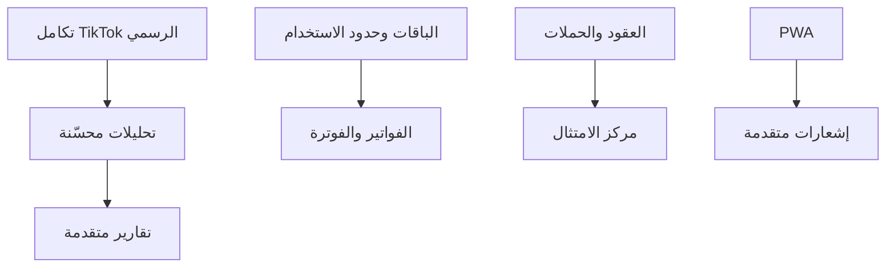
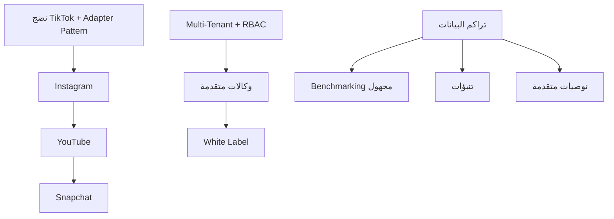

# خارطة الطريق (Roadmap) — «صانع المحتوى»

> **الشركة:** نوفاميتريكس | NovaMetrics — «من الفكرة إلى التأثير»
> **إصدار الوثيقة:** 1.0 (اختبار سوق) — **التاريخ:** 2026-07-18
> **مرجع:** `product-requirements-document-ar.md` و`mvp-scope-ar.md`

---

## 1. نظرة عامة

خارطة طريق مرحلية تنقل المنتج من التحليل إلى نظام تشغيل ناضج متعدد المنصات ومتعدد المواهب. كل مرحلة تُبنى فوق سابقتها، وتلتزم بمبادئ المنتج: **Arabic-first / RTL**، **Multi-Tenant**، **لا تكاملات وهمية مقنّعة**، **عدم ادعاء نجاح النشر قبل تأكيد رسمي**، **لا أسرار في الكود**، **مراجعة قانونية نهائية من مختص مرخّص**.

---

## 2. المرحلة صفر — التحليل (Phase 0: Discovery)

**الهدف:** ترسيخ الفهم والتصميم قبل البناء.

**المخرجات:**
- تثبيت الحقائق الأساسية للمنتج والشخصيات والوظائف (JTBD).
- نموذج البيانات الأولي (Prisma schema) مع `tenantId` والحذف الناعم ومعلومات التدقيق.
- تصميم معماري لنمط المحوّل (Adapter Pattern) للمنصات.
- تصميم RBAC ومصفوفة الصلاحيات.
- تصميم تجربة عربية RTL (Wireframes) للمسار الأساسي.
- تعريف مقاييس النجاح (KPIs) وخطة اختبار السوق.

**التبعيات:** لا شيء (نقطة البداية).

**بوابة الانتقال:** اعتماد النطاق والتصميم المعماري ونموذج البيانات.

---

## 3. المرحلة 1 — الحد الأدنى القابل للتسويق (Phase 1: MVP)

**الهدف:** إثبات القيمة الأساسية عبر المسار الكامل مع عملاء حقيقيين.

**النطاق:** كامل عناصر الـ MVP الواردة في `mvp-scope-ar.md`:
- المصادقة وRBAC، تعدد المستأجرين، ملف صانع المحتوى.
- الاستراتيجية، أعمدة المحتوى، بنك الأفكار، السيناريوهات.
- سير عمل الإنتاج، التقويم، المهام، جلسات التصوير، مكتبة الأصول.
- الموافقات، التحليلات التجريبية + الإدخال اليدوي.
- الحملات الأساسية، العقود الأساسية، الباقات والاشتراك التجريبي.
- لوحة نوفاميتريكس، الواجهة العربية، Seed، اختبارات أساسية.
- **النشر عبر Mock Provider** بتصريح واضح (بدون ادعاء نجاح حقيقي).

**التسلسل الداخلي المقترح:**
1. الأساس: المصادقة + Multi-Tenancy + RBAC + Seed.
2. الكيان المركزي: ملف صانع المحتوى + الاستراتيجية + الأعمدة.
3. المسار الإبداعي: بنك الأفكار ← السيناريوهات ← Workflow.
4. الإنتاج: جلسات التصوير + مكتبة الأصول + المهام + التقويم.
5. الحَوكمة: الموافقات + بوابة العميل (أساسية).
6. القياس: التحليلات التجريبية + الإدخال اليدوي.
7. التجاري: الحملات + العقود الأساسية + الباقات + لوحة نوفاميتريكس.
8. الجودة: الاختبارات الأساسية.

**التبعيات:** تعتمد كل الوحدات على أساس Multi-Tenancy + RBAC؛ لذا يُبنى الأساس أولاً.

**بوابة الانتقال:** تحقيق Definition of Done للـ MVP + مؤشرات تبنٍّ أولية من عملاء اختبار السوق.

---

## 4. المرحلة 2 — التكامل الرسمي والتعميق (Phase 2)

**الهدف:** تحويل الحلقات التجريبية إلى حلقات حقيقية موثوقة وتعميق القيمة.

**النطاق:**
- **تكامل TikTok الرسمي:** عبر API الرسمي؛ نشر حقيقي مع تأكيد رسمي قبل ادعاء النجاح (يحل محل Mock).
- **التحليلات المحسّنة:** سحب البيانات رسمياً وربطها بالمحتوى والأعمدة.
- **التقارير المتقدمة:** تقارير شهرية/دورية قابلة للتصدير بحسب الباقة.
- **مساعد الذكاء الاصطناعي:** توسّع التوليد (أفكار/عناوين/سيناريوهات/تحسينات) بحدود حسب الباقة.
- **الفواتير والفوترة:** فوترة فعلية وحدود استخدام آلية (مع مراعاة ضريبة القيمة المضافة 15% حيث تنطبق).
- **مركز الامتثال:** تسجيل الالتزامات النظامية (كالإفصاح الإعلاني) وإثباتها (يخضع لمراجعة مختص مرخّص).
- **مركز السمعة والأزمات:** رصد وتسجيل حوادث وبروتوكولات استجابة.
- **PWA:** تجربة قابلة للتثبيت وعمل جزئي دون اتصال.
- **الإشعارات المتقدمة:** تنبيهات متعددة القنوات على الأحداث المهمة.

**التسلسل والتبعيات:**
- **تكامل TikTok الرسمي** شرط أساسي لـ **التحليلات المحسّنة** ثم **التقارير المتقدمة**.
- **الفوترة** تعتمد على استقرار الباقات وحدود الاستخدام من المرحلة 1.
- **مركز الامتثال** يعتمد على العقود/الحملات ويتطلب مدخلات قانونية.
- **PWA والإشعارات** تحسينات تجربة تُنفّذ بالتوازي مع باقي المسار.

**بوابة الانتقال:** نشر حقيقي موثوق + فوترة فعّالة + تقارير معتمدة من العملاء.

---

## 5. المرحلة 3 — توسّع المنصات والوكالات (Phase 3)

**الهدف:** التوسّع الأفقي عبر المنصات والنماذج المتقدمة وبناء ميزات تنافسية.

**النطاق:**
- **منصات إضافية:** Instagram ثم YouTube ثم Snapchat (وX/LinkedIn لاحقاً) عبر Adapter Pattern دون إعادة بناء.
- **الوكالات المتقدمة:** حسابات منفصلة لكل موهبة، صلاحيات فريق متقدمة، تقارير مجمّعة، عبء عمل (Workload).
- **White Label:** علامة بيضاء للوكالات.
- **تطبيق جوّال أصلي (Mobile App).**
- **Marketplace:** سوق لخدمات/مواهب/قوالب.
- **Benchmarking مجهول:** مقارنات معيارية مع الحفاظ على الخصوصية.
- **التنبؤات (Forecasting):** تنبؤ بالأداء والاتجاهات.
- **التوصيات المتقدمة:** توصيات ذكية تتعلّم من الأرشيف المعرفي.

**التسلسل والتبعيات:**
- **إضافة المنصات** تعتمد على نضج معمارية المحوّل ومسار النشر من المرحلة 2.
- **الوكالات المتقدمة وWhite Label** تعتمد على تعدد المستأجرين وRBAC.
- **Benchmarking/التنبؤات/التوصيات المتقدمة** تعتمد على تراكم بيانات كافٍ من المرحلتين 1 و2.
- **Marketplace وMobile App** يعتمدان على نضج تشغيلي وقاعدة مستخدمين.

**بوابة الانتقال:** دعم متعدد المنصات مستقر + نموذج وكالات فعّال + ميزات ذكاء تعتمد على البيانات.

---

## 6. ملخص التبعيات الحاكمة

| التبعية | تحكم في |
|--------|---------|
| Multi-Tenancy + RBAC (المرحلة 1) | كل الوحدات والنماذج التجارية اللاحقة. |
| تكامل TikTok الرسمي (المرحلة 2) | التحليلات المحسّنة والتقارير المتقدمة والنشر الحقيقي. |
| Adapter Pattern (م0/م2) | إضافة المنصات في المرحلة 3 دون إعادة بناء. |
| تراكم البيانات (م1/م2) | Benchmarking والتنبؤات والتوصيات المتقدمة. |
| مراجعة قانونية من مختص مرخّص | مركز الامتثال والعقود والفوترة قبل الإطلاق التجاري. |

> **ملاحظة:** التسلسل الزمني تقديري (Rough Sequencing) لأغراض التخطيط واختبار السوق، وقابل للتعديل حسب نتائج كل مرحلة.
