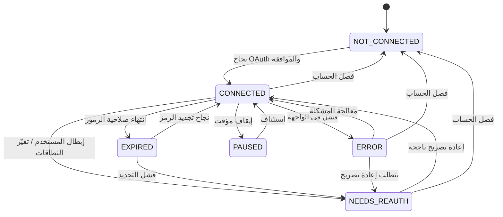

# خطة التكامل مع TikTok — «صانع المحتوى» / Content Maker

**الجهة:** نوفاميتريكس | NovaMetrics
**المبدأ الحاكم:** لا تكاملات زائفة، ولا ادّعاء نجاح نشر قبل تأكيد رسمي من واجهة المنصة، ولا أتمتة غير رسمية.

> يُنفَّذ التكامل على **مرحلتين**: مرحلة أولى يدوية بالكامل (بلا أتمتة)، ثم مرحلة ثانية تعتمد طبقة تكامل عبر **واجهة TikTok الرسمية** فقط بعد الحصول على الموافقات اللازمة.

---

## 1. الفلسفة والقيود الأساسية

- **الاعتماد الحصري على القنوات الرسمية:** التكامل الآلي لن يتم إلا عبر واجهة TikTok الرسمية (Official API) وبعد اعتماد التطبيق.
- **لا ادّعاء نجاح مبكر:** لا تُعلَن حالة المنشور «تم النشر» (`PUBLISHED`) إلا بعد أن تُعيد الواجهة الرسمية تأكيد نجاح مؤكَّدًا.
- **احترام تجربة وشروط TikTok:** الالتزام الكامل بإرشادات التجربة (UX Guidelines) وشروط الخدمة وسياسات المطوّرين.
- **الخصوصية والموافقة:** لا يتم أي وصول لحساب المستخدم إلا بموافقته الصريحة عبر تدفّق OAuth الرسمي.

---

## 2. المرحلة الأولى — التحضير اليدوي (بلا أتمتة)

في هذه المرحلة **لا يوجد أي اتصال آلي** بـ TikTok. النظام أداة تنظيم وتحضير فقط، والنشر يتم يدويًا من المستخدم داخل تطبيق TikTok الرسمي.

### 2.1 قائمة التحقّق قبل النشر (Pre-Publish Checklist)

قبل تعيين المنشور كجاهز، تُستكمل قائمة تحقّق (مخزَّنة في كيان `Checklist`) تشمل:

- [ ] اعتماد النص/السيناريو النهائي (`Script.status = APPROVED`).
- [ ] اجتياز بوابة الاعتماد (`Approval.decision = APPROVED`).
- [ ] اجتياز مراجعة الامتثال والإفصاح الإعلاني (`ComplianceReview.result = PASSED`).
- [ ] التحقّق من حقوق الموسيقى/الأصول (`LicenseRecord` سارٍ).
- [ ] جاهزية الفيديو النهائي (`Asset.status = READY`) بالمواصفات الصحيحة.
- [ ] تجهيز الوصف والهاشتاقات.

### 2.2 خطوات التنفيذ اليدوي

1. **نسخ الوصف والهاشتاقات:** يوفّر النظام زر نسخ للوصف والهاشتاقات الجاهزة لِلصقها في تطبيق TikTok.
2. **رفع الفيديو النهائي:** المستخدم يرفع/يصدّر الفيديو النهائي من الأصول ثم ينشره **يدويًا** عبر تطبيق TikTok الرسمي.
3. **تعيين الحالة «جاهز للنشر»:** داخل النظام، يُحدَّث `PublishedPost.status = READY_TO_PUBLISH` و`publishMethod = MANUAL`.
4. **إدخال رابط المنشور بعد النشر:** بعد النشر الفعلي على TikTok، يُدخل المستخدم **رابط المنشور** (`PublishedPost.postUrl`) ويُحدَّث `status = PUBLISHED` و`publishedAt` يدويًا.
5. **متابعة المقاييس يدويًا:** تُدخَل لقطات المقاييس (`MetricSnapshot.source = MANUAL`) عند الحاجة.

> في هذه المرحلة، «النشر» فعل بشري بالكامل؛ النظام يوثّق النتيجة ولا يدّعيها.

---

## 3. المرحلة الثانية — طبقة التكامل عبر الواجهة الرسمية

تُفعَّل هذه المرحلة **بعد** استيفاء متطلبات TikTok واعتماد التطبيق. تعتمد على طبقة تجريد (Adapter) تُبقي بقية النظام مستقلًّا عن تفاصيل المنصة.

### 3.1 تسجيل التطبيق والموافقات المطلوبة

- **تسجيل التطبيق لدى TikTok** في بوابة المطوّرين الرسمية، وتحديد الأغراض والنطاقات (Scopes) المطلوبة.
- **طلب الموافقات/المراجعات اللازمة** لاعتماد التطبيق للنشر والقراءة (حسب متطلبات المنصة وقت التنفيذ).
- الالتزام بمتطلبات المراجعة الأمنية وسياسات الخصوصية التي تطلبها المنصة.

### 3.2 تدفّق OAuth وإدارة النطاقات والموافقة

- **تدفّق OAuth الرسمي:** يوجَّه المستخدم لصفحة موافقة TikTok الرسمية، ويمنح الوصول صراحةً.
- **إدارة النطاقات (Scopes):** طلب أقل النطاقات اللازمة فقط (Least Privilege)، وتوثيقها في `OAuthConnection.scopes`.
- **موافقة المستخدم:** لا وصول بلا موافقة صريحة؛ تُسجَّل الموافقة وتُحترم إمكانية سحبها.
- **تخزين الرموز مشفّرة:** `accessTokenEnc` / `refreshTokenEnc` مشفّرة عند الراحة، **ولا تظهر في الواجهة أو السجلات**.

### 3.3 انتهاء صلاحية الرموز وتجديدها

- متابعة `OAuthConnection.expiresAt` وتجديد رمز الوصول عبر `refreshToken` قبل انتهائه.
- عند فشل التجديد أو إبطال المستخدم للوصول: نقل الحالة إلى `NEEDS_REAUTH` أو `EXPIRED` وإخطار المستخدم لإعادة التصريح.
- عدم تنفيذ أي عملية بالرمز المنتهي؛ إيقاف العمليات وطلب إعادة التصريح.

### 3.4 تسجيل عمليات النشر والأخطاء

- تسجيل كل محاولة نشر ونتيجتها في سجلات مخصّصة و`AuditLog` (بدون تضمين الرموز الحسّاسة).
- عند الخطأ: تسجيل رمز/رسالة الخطأ من الواجهة الرسمية، وربطها بالمنشور المتأثّر، وعرض حالة واضحة للمستخدم.

### 3.5 القاعدة الذهبية للنشر

> **لا يُعلَن نجاح النشر (`PublishedPost.status = PUBLISHED`) إطلاقًا قبل أن تُعيد واجهة TikTok الرسمية تأكيد نجاح مؤكَّدًا.**

- قبل التأكيد: الحالة `READY_TO_PUBLISH` أو حالة معالجة/انتظار.
- عند رفض/فشل الواجهة: الحالة `FAILED` مع تفاصيل السبب.
- عند تأكيد النجاح من الواجهة فقط: `PUBLISHED` + `externalPostId` + `postUrl` + `publishedAt` (و`publishMethod = API`).

---

## 4. نمط المُحوِّل (Adapter Pattern)

لضمان قابلية توسّع تعدد المنصات، تُعزَل تفاصيل كل منصة خلف واجهة موحّدة `PublishAdapter`. يعتمد النظام على الواجهة المجرّدة لا على التنفيذ.

### 4.1 الواجهة الموحّدة `PublishAdapter`

عقد مجرّد يصف العمليات المشتركة (وصف تعاقدي — ليس شيفرة تطبيق):

- `connect(consent)` — بدء الاتصال/التصريح والحصول على موافقة المستخدم.
- `getStatus()` — إرجاع حالة التكامل الحالية (راجع آلة الحالات).
- `validate(content)` — التحقّق من مطابقة المحتوى لمتطلبات المنصة قبل النشر.
- `publish(content)` — طلب النشر عبر القناة الرسمية.
- `confirm(reference)` — التأكّد من نتيجة النشر من المصدر الرسمي قبل إعلان النجاح.
- `fetchMetrics(postRef)` — جلب المقاييس الرسمية (عند دعمها).
- `refreshToken()` — تجديد رمز الوصول.
- `disconnect()` — فصل الحساب وإبطال الرموز.

### 4.2 التنفيذات

| المُحوِّل | الوصف |
|---|---|
| **`TikTokAdapter`** | تنفيذ فعلي عبر واجهة TikTok الرسمية، يطبّق OAuth والنشر والتأكيد وإدارة الرموز والأخطاء. |
| **`MockAdapter`** | مزوّد وهمي للتطوير والاختبار في الـ MVP؛ يحاكي التدفّق **دون ادّعاء أنه حقيقي** ودون أي اتصال فعلي بأي منصة. |
| منصّات مستقبلية | `InstagramAdapter` / `YouTubeAdapter` … تُضاف لاحقًا بتنفيذ نفس الواجهة `PublishAdapter` دون تغيير بقية النظام. |

> **قاعدة صريحة:** الـ `MockAdapter` أداة تطوير/اختبار فقط ولا يُقدَّم للمستخدم كتكامل حقيقي، ولا يُعلَن أي «نجاح نشر» صادر عنه كأنه نشر فعلي.

---

## 5. آلة حالات التكامل (Integration Status State Machine)

تُمثَّل حالة التكامل عبر `Integration.status` و`OAuthConnection.status` بالقيم الست التالية:

| الحالة | المعرّف (English) | الوصف |
|---|---|---|
| **غير متصل** | `NOT_CONNECTED` | لا يوجد اتصال؛ الوضع الابتدائي. |
| **متصل** | `CONNECTED` | اتصال سارٍ وموافقة نافذة. |
| **يحتاج إعادة تصريح** | `NEEDS_REAUTH` | يلزم أن يعيد المستخدم منح الموافقة. |
| **انتهت الصلاحية** | `EXPIRED` | انتهت صلاحية الرموز ولم تُجدَّد. |
| **توجد مشكلة** | `ERROR` | خطأ في الاتصال/الواجهة يتطلّب معالجة. |
| **متوقف مؤقتًا** | `PAUSED` | إيقاف مؤقت متعمَّد من المستأجر/المستخدم. |

### مخطط الانتقالات

---

## 6. ممنوعات صريحة (Explicitly Forbidden)

يُحظَر تمامًا، بلا استثناء:

1. **الأتمتة غير الرسمية:** أي نشر/تفاعل آلي خارج واجهة TikTok الرسمية.
2. **الاستخلاص (Scraping):** كشط بيانات TikTok أو الوصول لواجهات غير رسمية/معكوسة.
3. **طلب كلمات مرور TikTok من المستخدمين:** لا يُطلب من المستخدم كلمة مرور حسابه على TikTok إطلاقًا؛ الوصول عبر OAuth الرسمي حصرًا.
4. **ادّعاء نجاح النشر قبل التأكيد الرسمي:** لا تُعرض حالة «تم النشر» قبل تأكيد الواجهة الرسمية.
5. **مخالفة شروط الخدمة أو إرشادات التجربة** الخاصة بـ TikTok.

---

## 7. خلاصة الالتزامات

- المرحلة 1 يدوية بالكامل وشفّافة: النظام يحضّر ويوثّق، والإنسان ينشر.
- المرحلة 2 عبر الواجهة الرسمية فقط، بموافقة صريحة وإدارة آمنة للرموز.
- نمط `PublishAdapter` يجعل إضافة منصّات جديدة مسألة تنفيذ محوّل جديد لا إعادة بناء.
- لا ادّعاء نجاح، ولا أتمتة غير رسمية، ولا كلمات مرور منصّات — أبدًا.

