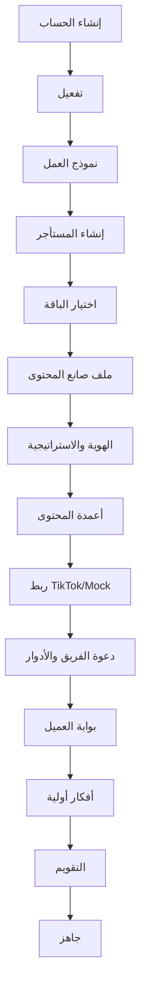
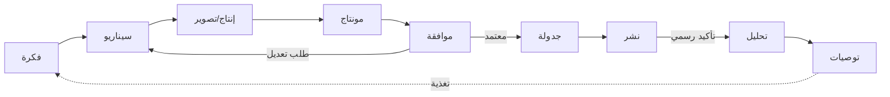
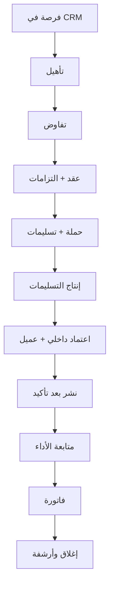
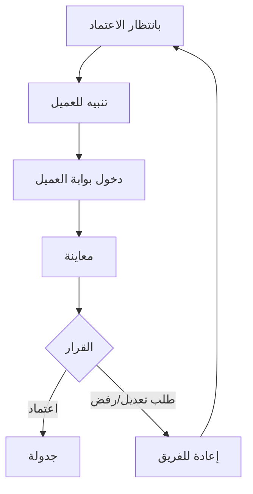
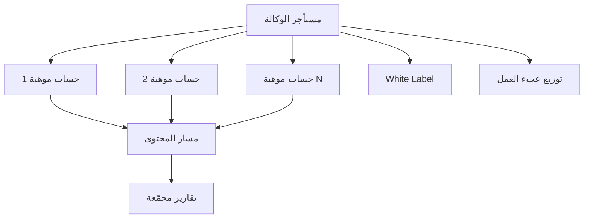
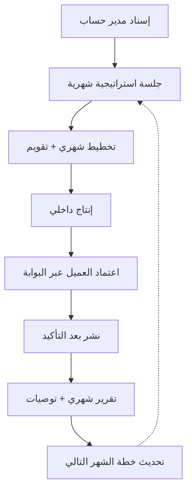

# مسارات المستخدم (User Flows) — «صانع المحتوى»

> **الشركة:** نوفاميتريكس | NovaMetrics — «من الفكرة إلى التأثير»
> **إصدار الوثيقة:** 1.0 (اختبار سوق) — **التاريخ:** 2026-07-18
> **مرجع:** `product-requirements-document-ar.md` و`user-roles-and-permissions-ar.md`

---

## 1. مسار الإعداد الأولي (Onboarding Wizard) — 20 خطوة

يمرّ العميل الجديد بمعالج إعداد عربي RTL ينقله «من الفكرة إلى التأثير» تدريجياً:

1. إنشاء الحساب وتسجيل الدخول عبر Auth.js.
2. تأكيد البريد وتفعيل الحساب.
3. اختيار نموذج العمل: Self-serve / خدمة مُدارة / وكالة.
4. إنشاء المستأجر (Tenant) وربط `tenantId` بالحساب.
5. اختيار الباقة (الانطلاقة / الاحتراف / النجم / الإدارة المتكاملة / الوكالات) وبدء اشتراك تجريبي.
6. إنشاء ملف صانع المحتوى (Creator Profile).
7. تعريف الهوية: الرسالة والقيم.
8. تحديد الجمهور المستهدف وشرائحه.
9. ضبط نبرة الصوت والمرجعيات البصرية.
10. تحديد الأهداف قصيرة/طويلة المدى.
11. تعريف أعمدة المحتوى ونِسَبها المستهدفة.
12. ربط قناة TikTok (عبر Mock Provider في المراحل التجريبية بتصريح واضح).
13. دعوة أعضاء الفريق وتعيين الأدوار (RBAC).
14. ضبط صلاحيات كل عضو حسب دوره.
15. إعداد بوابة العميل (للاعتماد النهائي عند الحاجة).
16. توليد أفكار أولية في بنك الأفكار (يدوياً أو بمساعدة الذكاء الاصطناعي حسب الباقة).
17. إنشاء أول عنصر في التقويم التحريري.
18. ضبط تفضيلات التنبيهات.
19. جولة تعريفية سريعة بالوحدات الأساسية.
20. لوحة البداية جاهزة — إنهاء المعالج والانطلاق.

---

## 2. مسار المحتوى: فكرة ← سيناريو ← إنتاج ← موافقة ← نشر ← تحليل

1. **الفكرة:** ينشئ الكاتب/مدير المحتوى فكرة في بنك الأفكار، يربطها بعمود محتوى ويضع وسوماً.
2. **التطوير:** تنتقل الفكرة إلى «قيد التطوير»، مع دعم مقترحات المساعد الذكي.
3. **السيناريو:** يحوّل الكاتب الفكرة إلى سيناريو ببنية (خطاف، محتوى، خاتمة، CTA) وإصدار أول.
4. **مراجعة السيناريو:** يراجعه مدير المحتوى؛ ملاحظات وتعديلات حتى الاعتماد المبدئي.
5. **التخطيط للإنتاج:** يُنشأ مشروع في سير العمل وتُجدوَل جلسة تصوير بقائمة لقطات.
6. **التصوير:** ينفّذ المصوّر الجلسة ويرفع الأصول الخام إلى المكتبة عبر Signed URLs.
7. **المونتاج:** يعالج المونتير الأصول ويسلّم المخرج النهائي بإصدار للمراجعة.
8. **المراجعة النهائية:** يراجع مدير المحتوى ثم يُحال للاعتماد.
9. **الموافقة:** يعتمد المعتمِد النهائي/المشهور عبر بوابة العميل (اعتماد/رفض/طلب تعديل) مع تسجيل القرار.
10. **الجدولة:** يُجدوَل المحتوى المعتمد في التقويم التحريري.
11. **النشر:** يُطلق أمر النشر إلى TikTok. **لا يُعرض نجاح إلا بعد تأكيد رسمي من API** (أو تصريح Mock في المراحل التجريبية).
12. **التحليل:** تُجمع بيانات الأداء (رسمياً لاحقاً أو إدخالاً يدوياً حالياً) وتُربط بالمحتوى والعمود.
13. **التوصيات:** تتحول النتائج إلى توصيات تُغذّي بنك الأفكار والاستراتيجية (حلقة تعلّم).

---

## 3. مسار الحملة التجارية: من الفرصة إلى الفاتورة

1. **التقاط الفرصة:** يسجّل مسؤول الشراكات فرصة/معلن في CRM.
2. **التأهيل:** تقييم الملاءمة مع الهوية والأعمدة والجمهور.
3. **التفاوض:** الاتفاق على النطاق والتسليمات والسعر.
4. **العقد:** إنشاء/إرفاق العقد وربطه بالحملة وتسجيل الالتزامات.
5. **إنشاء الحملة:** تعريف الحملة والتسليمات والمواعيد النهائية.
6. **الالتزام النظامي:** تسجيل متطلبات الإفصاح الإعلاني (يخضع لمراجعة مختص مرخّص).
7. **الإنتاج:** تسير التسليمات عبر مسار المحتوى (فكرة ← ... ← اعتماد).
8. **الاعتماد المزدوج:** اعتماد داخلي ثم اعتماد العميل/المعلن عبر بوابة العميل.
9. **النشر والتنفيذ:** تُنشر التسليمات بعد التأكيد الرسمي.
10. **المتابعة:** تتبّع أداء الحملة وربطه بالتسليمات.
11. **الفاتورة:** إصدار الفاتورة عند اكتمال التسليمات (مع مراعاة ضريبة القيمة المضافة 15% حيث تنطبق).
12. **الإغلاق والأرشفة:** أرشفة العقد والتسليمات والتقرير في الأرشيف المعرفي.

---

## 4. مسار الموافقة عبر بوابة العميل

1. يصل المحتوى لمرحلة «بانتظار الاعتماد».
2. يُرسل تنبيه إلى العميل (المشهور/مدير الأعمال) عبر بوابته.
3. يسجّل العميل الدخول إلى بوابة العميل (وصول محدود دون تفاصيل التشغيل الداخلية).
4. يعاين المحتوى والسيناريو والأصل النهائي.
5. يتخذ قراراً: **اعتماد** أو **رفض** أو **طلب تعديل** مع تعليق.
6. **اعتماد:** ينتقل المحتوى إلى الجدولة؛ يُسجّل القرار وهوية المعتمِد والوقت (Audit).
7. **طلب تعديل / رفض:** يعود المحتوى للفريق مع الملاحظات لدورة تعديل جديدة.
8. تتكرر الحلقة حتى الاعتماد النهائي.

---

## 5. مسار الوكالة متعددة المواهب

1. تُنشئ الوكالة مستأجرها وتختار باقة الوكالات.
2. تُنشئ **حساباً منفصلاً لكل موهبة** مع عزل بيانات صارم.
3. تُعيّن فرقاً وصلاحيات متقدمة عبر المواهب.
4. تُشغّل مسار المحتوى لكل موهبة على حدة (فكرة ← ... ← نشر ← تحليل).
5. يوزّع مدير الوكالة عبء العمل (Workload) بين الفرق.
6. تُدار العقود والحملات لكل موهبة، مع أرشفة موحّدة.
7. تُجمّع التقارير عبر المواهب في **تقارير مجمّعة** مع الحفاظ على العزل.
8. تُفعّل إضافة **White Label** (مرحلة لاحقة) لعرض علامة الوكالة.
9. يتابع **مدير نجاح العملاء** الأداء والتجديد.

---

## 6. مسار الخدمة المُدارة من نوفاميتريكس

1. يُسند عميل «النجم»/«الإدارة المتكاملة» إلى **مدير حساب** من نوفاميتريكس.
2. **جلسة استراتيجية شهرية** لضبط الهوية والأهداف.
3. **تخطيط شهري:** توليد أفكار وبناء التقويم التحريري.
4. الاتفاق على **عدد سيناريوهات** ومتابعة الإنتاج.
5. يشغّل مدير الحساب مسار المحتوى داخلياً (فكرة ← سيناريو ← إنتاج ← مراجعة).
6. **الاعتماد النهائي للعميل** عبر بوابته الخاصة قبل النشر.
7. **النشر** بعد التأكيد الرسمي (لا ادعاء نجاح مسبق).
8. **متابعة الحملات والموافقات** نيابة عن العميل ضمن صلاحياته.
9. **تقرير شهري + توصيات** يُسلَّم للعميل.
10. مراجعة الأداء وتحديث الخطة للشهر التالي (حلقة تحسّن مستمرة)، مع أولوية دعم.

---

## 7. قواعد مشتركة عبر المسارات

- كل عملية حسّاسة تُسجَّل بمعلومات تدقيق ضمن `tenantId`.
- لا يتجاوز أي مسار حدود عزل المستأجر.
- لا يُعرض «نجاح النشر» في أي مسار قبل تأكيد رسمي من API المنصة (أو تصريح Mock واضح تجريبياً).
- الاعتماد النهائي شرط سابق للنشر في كل المسارات.
- كل نتائج الأداء تُغذّي الأرشيف المعرفي والتوصيات (حلقة تعلّم).
